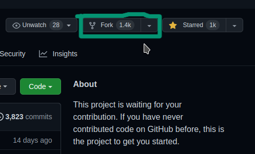
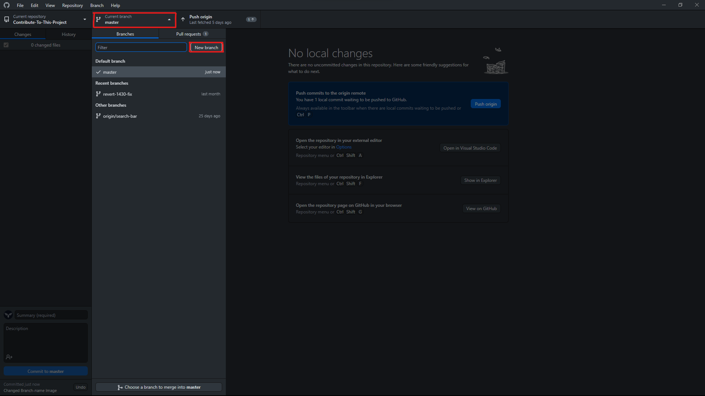
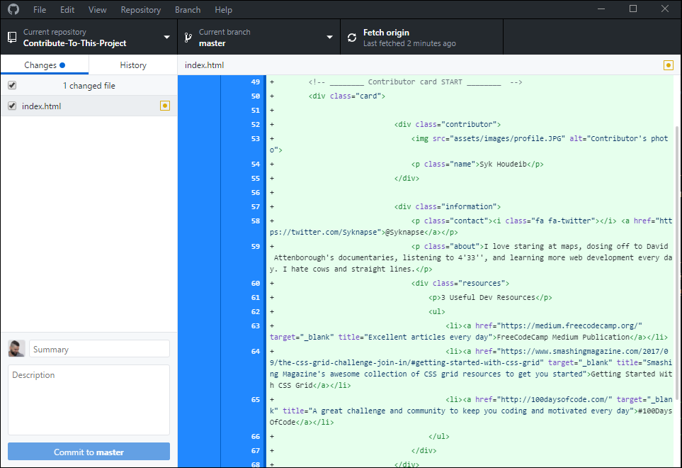
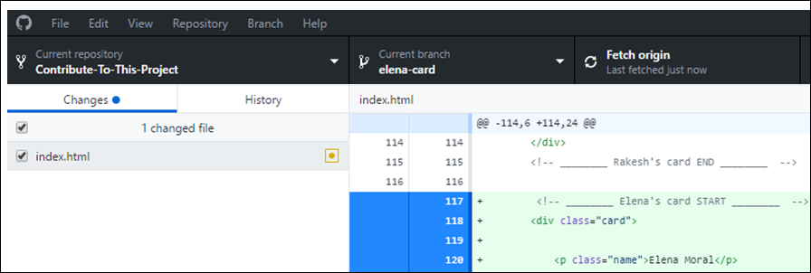
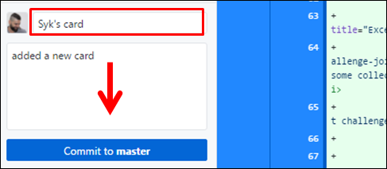
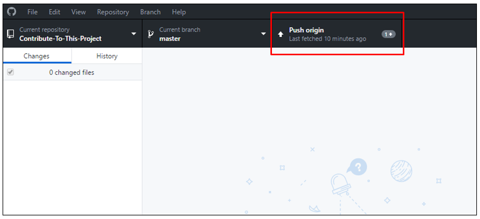
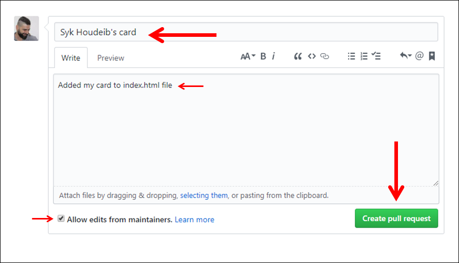

# [Contribute To This Project](https://syknapse.github.io/Contribute-To-This-Project/)

> ## **Announcement:**
>
> Would you like to become a maintainer on this project and help keeping it going? If you are interested, read the [maintainer's guide](maintainer_guide.md) and send me a DM on [Twitter](https://twitter.com/Syknapse).

## Introduction

This is a tutorial to help first-time contributors to participate in a simple and easy project.

### Objectives

- Make a contribution to an open source project.
- Get more comfortable in using GitHub.

#### Who is this for?

- This is for absolute beginners. If you know how to write and edit an anchor tag `` then you should be able to do it.
- It is also for those with a little more experience but who want to make their first open source contribution, or get more contributions for more experience and confidence.

<h5 align="center">Why do I need to do this?</h5>

Any web developer, aspiring or experienced needs to use Git version control, and GitHub is the most popular Git hosting service used by everyone. It is also the heart of the Open Source community. Getting comfortable using GitHub is an essential skill. Making a contribution to a project boosts your confidence and gives you something to show on your GitHub profile. 
If you are a new developer and you are wondering if you need to learn Git and GitHub then here is the answer: [You Should've Learned Git Yesterday](https://codeburst.io/number-one-piece-of-advice-for-new-developers-ddd08abc8bfa 'New Developer? You should’ve learned Git yesterday. by Brandon Morelli, creator of CodeBurst.io').

<h4 align="center">What am I going to contribute?</h4>

You are going to contribute a card just like this one to this [project's web page](https://syknapse.github.io/Contribute-To-This-Project/ 'https://syknapse.github.io/Contribute-To-This-Project'). It will include your name, your Twitter handle, a short description, and 3 links to useful resources for web developers that you recommend.

You will make a copy of the card template inside the HTML file and customise it with your own information.

# [If you're comfortable with the terminal go to this tutorial](/terminal-tutorial.md)

<h4 align="center">Translations</h4>

This tutorial is also available in [other languages](translations/translation.md)

| [Arabic](translations/README/ARABIC.md)         | [French](translations/README/FRENCH.md)   | [German](translations/README/German.md)   | [Italian](translations/README/ITALIAN.md) | [Korean](translations/README/KOREAN.md) | [Polish](translations/README/POLISH.md) | [Japan](translations/README/JAPANESE.md) |
| ----------------------------------------------- | ----------------------------------------- | ----------------------------------------- | ----------------------------------------- | --------------------------------------- | --------------------------------------- | --------------------------------------- |
| [Portuguese](translations/README/PORTUGUESE.md) | [Serbian](translations/README/SERBIAN.md) | [Spanish](translations/README/SPANISH.md) | [Turkish](translations/README/TURKISH.md) | [Bangla](translations/README/BANGLA.md) | [Hindi](translations/README/HINDI.md) | English |

> Translations for either this README or the maintainer README file are very welcome!.

<h4 align="center">Quick Access Index</h4>

| <ul><li>[Introduction](#introduction)</li><li>[What am I going to contribute?](#what-am-i-going-to-contribute)</li><li>[Setup](#setup-)</li><li>[Contribute &rightarrow;](#contribute)</li><li>[Next Steps](#next-steps)</li><li>[Acknowledgements](#acknowledgements)</li></ul> | Contribute: <ul><li>[Step 1: Fork this repository](#step-1-fork-this-repository)</li><li>[Step 2: Clone the repository](#step-2-clone-the-repository)</li><li>[Step 3: Create a new branch](#step-3-create-a-new-branch)</li><li>[Step 4: Open the index.html file](#step-4-open-the-indexhtml-file)</li><li>[Step 5: Copy the card template](#step-5-copy-the-card-template)</li><li>[Step 6: Apply your changes](#step-6-apply-your-changes)</li><li>[Step 7: Commit your changes](#step-7-commit-your-changes)</li><li>[Step 8: Push your changes to GitHub](#step-8-push-your-changes-to-github)</li><li>[Step 9: Submit a PR](#step-9-submit-a-prpull-request)</li><li>[Step 10: Celebrate!](#step-10-celebrate)</li></ul> |
| :------------------------------------------------------------------------------------------------------------------------------------------------------------------------------------------------------------------------------------------------------------------------------- | :------------------------------------------------------------------------------------------------------------------------------------------------------------------------------------------------------------------------------------------------------------------------------------------------------------------------------------------------------------------------------------------------------------------------------------------------------------------------------------------------------------------------------------------------------------------------------------------------------------------------------------------------------------------------------------------------------------------------------ |

<h4 align="center">Setup! :)</h4>

First let's get setup to do the work

1. Login to your GitHub account. If you don't yet have an account then [join GitHub](https://github.com/join). I recommend that you do the [GitHub Hello World tutorial](https://guides.github.com/activities/hello-world/) before you continue.
1. Download [GitHub Desktop app](https://desktop.github.com/).
   - Alternatively if you are comfortable using Git on the command line you can do so [Here is the link to the CLI tutorial](terminal-tutorial.md).
   - If you use [VS Code](https://code.visualstudio.com/ 'Visual Studio Code website') it comes with integrated Git and allows you to do what we need straight from the editor.
   - However the simplest and easiest way to follow this tutorial is using GitHub Desktop.

## Now that you are all setup let's get on with the business of contributing to the project.  

## [↑ Go to top ↑](#quick-access-index)

<h4 align="center">Contribute</h4>

Become an open source contributor in 10 easy steps.

_Estimated time: Less than 30 minutes_.

<h5 align="center">Step 1: Fork this repository</h5>

- The objective here is to make a copy of this project and place it in your account.
- A repository (repo) is how a project is called on GitHub and a fork is a copy of it.
- Make sure you are on the [main page](https://github.com/Syknapse/Contribute-To-This-Project 'https://github.com/Syknapse/Contribute-To-This-Project') of this repo.

| <ul><li>Click on the _Fork_ button</li></ul> |  |
| :------------------------------------------- | ----------------------------------------------: |

- You now have a complete copy of the project in your own account.
  [↑ Go to top ↑](#quick-access-index)

---

<h5 align="center">Step 2: Clone the repository</h5>

- Now we want to make a local copy of the project. That is a copy saved on your own machine.
- Open the GitHub desktop app. In the app:

| <ul><li>Click on _File_ then _Clone repository_</li></ul> |  |
| :-------------------------------------------------------- | -------------------------------------------------------: |

| <ul><li>You will see a list of your projects and forks on GitHub.</li><li>Select `<your-github-username>/Contribute-To-This-Project`.</li><li>Click _Clone_</li></ul> |  |
| :-------------------------------------------------------------------------------------------------------------------------------------------------------------------- | :----------------------------------------------------------------------------------------------------------: |
| <ul><li>A forked project will have the fork symbol on the left.</li><li>Your fork will have your own GitHub user name.</li></ul>                                      |        |

- This will take a moment as the project is copied to your hard disk. I recommend that you keep the default path which is usually `..\Documents\GitHub`.
- Now you have a local copy of the project.

---

<h5 align="center">Step 3: Create a new branch</h5>

- Once the repo has been cloned and you have it open in GitHub desktop it is time to create a new branch.
- A branch is a way to keep your changes separate from the main part of the project called `Master`. For example if things go wrong and you are not happy with your changes you can simply delete the branch and the main project won't be affected.

| <ul><li>Click on _Current branch_</li><li>Then click on _New_</li></ul> |  |
| :---------------------------------------------------------------------- | ---------------------------------------------------------------------------: |

| <ul><li>Give your branch a name</li><li>Click `Create branch`</li></ul> |  |
| :---------------------------------------------------------------------- | -------------------------------------------------------------: |

- You can name it whatever you want, but since this is a branch to add a card with your name to the project, calling it `your-name-card` is good practice because it keeps the intention of this branch clear.

| <ul><li>Publish your new branch to GitHub</li></ul> |  |
| :-------------------------------------------------- | ------------------------------------------------------------------------------------------------------------------: |

- Now you have created a new branch separate from the master.
- For the next steps make sure you are working in this branch. You will see the name of the branch you are on at the top center of the GitHub desktop app where it says _Current branch_.

**Do NOT work on the `master` branch**

---

<h5 align="center">Step 4: Open the index.html file</h5>

- Now we need to open the file we are going to edit with your favourite code editor.
- Find the project folder on your computer. If you have kept the default this should be something like `your-computer > Documents > GitHub > Contribute-To-This-Project`
- The `index.html` file is directly in the `Contribute-To-This-Project` folder.

| <ul><li>Open your code editor (Sublime, VS Code, Atom..etc) and use the `Open file` command and locate the index.html file in the main directory of the project</li><li>Alternatively you can locate the file on your hard drive, right click, and open with your editor</li></ul> |  |
| :--------------------------------------------------------------------------------------------------------------------------------------------------------------------------------------------------------------------------------------------------------------------------------- | -----------------------------------------------------------------------------------: |

- Now you have the file you are going to edit open in your editor and you are ready to start making changes to it.

---

<h5 align="center">Step 5: Copy the card template></h5>

- We will make a copy of the card template to start working on it

| <ul><li>At the top of the html file, under the `<head>` and `<header>` sections you will find the section labelled `== TEMPLATE ==`</li><li>Copy everything within the red square in the image, from the `Contributor card START` comment to the `Contributor card END` comment</li></ul> |
| :---------------------------------------------------------------------------------------------------------------------------------------------------------------------------------------------------------------------------------------------------------------------------------------- |
|                                                                                                                                                                                                                  |

| <ul><li>Paste the whole thing directly below the comment indicating it</li><li>Make sure there is a single line of space between your card start and the last card end. It's good practice to keep our code as clear as possible</li><li>Never use a linters or style formatters. The project has Prettier setup</li></ul> |
| :------------------------------------------------------------------------------------------------------------------------------------------------------------------------------------------------------------------------------------------------------------------------------------------------------------------------- |
|                                                                                                                                                                                                                                         |

- This now is **your** card for you to customise and edit.

---

<h5 align="center">Step 6: Apply your changes</h5>

- We'll now start editing html, changing the customizable fields in our card.

| <ul><li>Replace 'Name' with your name</li><li>Note: Don't change `class="name"`</li></ul> |  |
| :---------------------------------------------------------------------------------------- | -----------------------------------------------------------: |

| <ul><li>Insert the URL of your Twitter account `href="Insert URL here"`</li><li>Type your handle in the text field</li></ul> |
| :--------------------------------------------------------------------------------------------------------------------------- |
|                |

- If you prefer to use a contact other than Twitter you will need to replace the twitter icon `<i class="fa fa-twitter"></i>` by going to [Font Awesome Icons](http://fontawesome.io/icons/) searching for the right icon and replacing only the `fa-twitter` part with the new icon like `fa-facebook` for example. Then follow the same steps above.

| <ul><li>Tell us something about you</li><li>Keep it short and sweet. Think about it more like a tweet than a blog post</li></ul> |  |
| :------------------------------------------------------------------------------------------------------------------------------- | -------------------------------------------------------------------------: |

| <ul><li>Share with the community 3 links to resources that are useful for web development</li><li>This can be anything, a video, a talk, a podcast, an article, a reference, or a tool</li><li>If you are a beginner don't be intimidated by this, share whatever you know even if you think it's basic. You'll be surprised how many people will benefit</li></ul> |
| :------------------------------------------------------------------------------------------------------------------------------------------------------------------------------------------------------------------------------------------------------------------------------------------------------------------------------------------------------------------ |
|                                                                                                                                                                                                                                    |
| <ul><li>Link: Insert the link `href="here"` replacing the `#`</li><li>Title: Write a brief description `title="here"`</li><li>Name: Write the resource's name in the text field `>here</a>`</li></ul>                                                                                                                                                               |

- Make sure you have **saved all your changes**.
- **Test your changes**. THIS IS IMPORTANT! Open the html file in your browser (by double clicking on it for example) and see what your card will look like on the site. See that the entire page still looks the same and nothing is broken. Click your links and make sure they are working. Open the console (Ctrl + Shift + J (Windows / Linux) or Cmd + Opt + J (Mac)) and check that there are no error messages.
- Great, you have finished editing your code! The next steps will send your changes to GitHub and then submit them to be merged with the main project.

---

<h5 align="center">Step 7: Commit your changes</h5>

- Go back to the GitHub desktop app.
- Your changes will have been added automatically to the staging area.
- This means that Git has recorded all the **saved** changes.
- You can see this reflected in the app. Everything you have added to the file will be in green, and deletions will show as red.

| <ul><li>The next step is called _Commit_</li><li>This roughly means "confirm the changes"</li></ul> |  |
| :-------------------------------------------------------------------------------------------------- | ---------------------------------------------------------------------------------------------------------------------------------------------------------------------------: |

| <ul><li>This is what your GitHub desktop header should look like</li><li>Notice the fork symbol next to the project name in `Current repository`</li><li>Your `Current branch` will have the name you gave it in step 3</li></ul> |
| :-------------------------------------------------------------------------------------------------------------------------------------------------------------------------------------------------------------------------------- |
|                                                |

| <ul><li>To _Commit_ you must fill in the _Summary_ field</li><li>This is the commit message explaining what you have changed</li><li>In this case "Add my card information" would be a reasonable message</li><li>Optionally you can add a more detailed _Description_</li><li>Click the _Commit_ button. Your button will say something like `Commit to "your-branch-name"`</li></ul> |  |
| :------------------------------------------------------------------------------------------------------------------------------------------------------------------------------------------------------------------------------------------------------------------------------------------------------------------------------------------------------------------------------------- | -------------------------------------------------------------------------------------------------------------------------------------------: |

---

<h5 align="center">Step 8: Push your changes to GitHub</h5>

- Your changes are now saved or committed. But they are saved only locally, that is on your computer.
- Synchronizing local changes with your repository on GitHub is called a _Push_. You are "pushing" the changes from your local repository to the remote repository on GitHub.

| <ul><li>Click the _Push_ button</li></ul> |  |
| :---------------------------------------- | ------------------------------------------------------------------------------------------------: |

- After a few seconds the operation is complete and now you have exactly the same copy of this branch on your machine as well as on GitHub.

---

<h5 align="center">Step 9: Submit a PR(Pull Request)</h5>

- This is the moment you have been waiting for; submitting a _Pull Request_ (PR).
- So far all the work you have done has been on the fork of the project, which as you remember resides on your own account of GitHub.
- Now it's time to send your changes to the main project to be merged with it.
- This is called a [_Pull Request_](https://help.github.com/articles/about-pull-requests/ 'About Pull Requests - GitHub Help') because you are asking the original project maintainer to "pull" your changes into their project.
- Go to the main page of **your fork** on GitHub (it will have the fork icon and your own user name at the top).
- Towards the top of the repo you will see a highlighted pull request message with a green button.

| <ul><li>Click on the `Compare and pull request`</li></ul> |  |
| :-------------------------------------------------------- | ------------------------------------------------------------------------------------------------------------------------------------------------------------------: |

| <ul><li>This is what the `Open a pull request` page looks like.</li><li>REMEMBER _you are trying to merge your branch with the original project not with the `Master` branch on your fork_.</li><li>The image below gives you an idea of how the header of your pull request should look like.</li><li>On the left is the original project, followed by the master branch. On the right is your fork and the branch you created.</li></ul> |
| :----------------------------------------------------------------------------------------------------------------------------------------------------------------------------------------------------------------------------------------------------------------------------------------------------------------------------------------------------------------------------------------------------------------------------------------- |
|                                                                                                                                                                                                                                                                       |

| <ul><li>Create a pull request:</li><li>Write a title</li><li>Add optional information in the description</li><li>Click `Create pull request`</li></ul> |  |
| :----------------------------------------------------------------------------------------------------------------------------------------------------- | -----------------------------------------------------------------------------------------------------: |

- Don't be fazed by all the options. You only need to do these three steps for now.
- Leave the option `Allow edits from maintainers` ticked.
- Now, a _Pull Request_ will be sent to the project maintainer. As soon as it is reviewed and accepted your changes will appear on the [project web page](https://syknapse.github.io/Contribute-To-This-Project 'Contribute To This Project web page').

---

<h5 align="center">Step 10: Celebrate!!</h5>

That's it. You have done it! You have now contributed to open source on GitHub.

You have added code to a live web page: [https://syknapse.github.io/Contribute-To-This-Project](https://syknapse.github.io/Contribute-To-This-Project)

Your changes **won't be visible immediately**; first they have to be reviewed, accepted, and merged by the project maintainer. Once they are merged your card should be visible and live on the page.

It is very normal for a reviewer to ask for changes on a PR. Think of it as good practice if it happens to you. Keep an eye for comments and requested changes. Once you make the requested changes (back in your branch) all you have to do is to commit and push your changes. The PR will automatically update with the new changes.

I promise I will try to review and merge as soon as possible but I do this in my spare time, so a few days delay is inevitable.

---

---

<h4 align="center">Next Steps</h4>

- Come back in a while to check for your merged Pull Request.
- You should receive an email from GitHub when your changes have been approved, or if additional changes are requested. And when the PR is finally merged with the master and your card has been added.
- If you found this project **useful** please give it a :star: star :star: at the top of the page and **Tweet** about it to help spread the word 
- You can **follow me** and get in touch on [Twitter](https://twitter.com/Syknapse '@Syknapse') or [using any of these other options](https://syknapse.github.io/Syk-Houdeib/#contact 'My contact section | Portfolio')
- This is an open source project so apart from contributing your card you are welcome to help fix bugs, improvements, or new features. Open an [issue](https://help.github.com/articles/creating-an-issue/ 'Mastering Issues | GitHub Guides') or send a new [pull request](https://help.github.com/articles/creating-a-pull-request-from-a-fork/ 'Creating a pull request from a fork | GitHub Help')
- To help improve our community take a look at the GitHub [Discussions](https://github.com/Syknapse/Contribute-To-This-Project/discussions) tab located next to Pull Requests. This area is a place to introduce yourself, go into deeper discussions on Open Source, and communicate with the Project Maintainers. Will you help us build out this feature and enhance our community?
- **Thanks for contributing to this project**. Now you can go ahead and try contributing to other projects; look for the  label for beginner-friendly contribution options.
- I'm also looking for collaborators to give me a hand in reviewing and merging PRs. If you would like to get more advanced Git practice please send me a DM on Twitter and read the [maintainer's guide](maintainer_guide.md).

<h4 align="center">Acknowledgements</h4>

This project is heavily influenced by [Roshan Jossey's](https://github.com/Roshanjossey) great [first-contributions](https://github.com/Roshanjossey/first-contributions) project with its excellent tutorial.

It is also particularly inspired by the great community around [#GoogleUdacityScholars](https://twitter.com/hashtag/GoogleUdacityScholars?src=hash) The Google Challenge Scholarship: Front-End Web Dev, class of 2017 Europe.

<h4 align="center">Project Info</h4>

<h4 align="center">PR info:</h4>

<h4 align="center">Maintainers</h4>

[Back to the top &uparrow;](#introduction)
