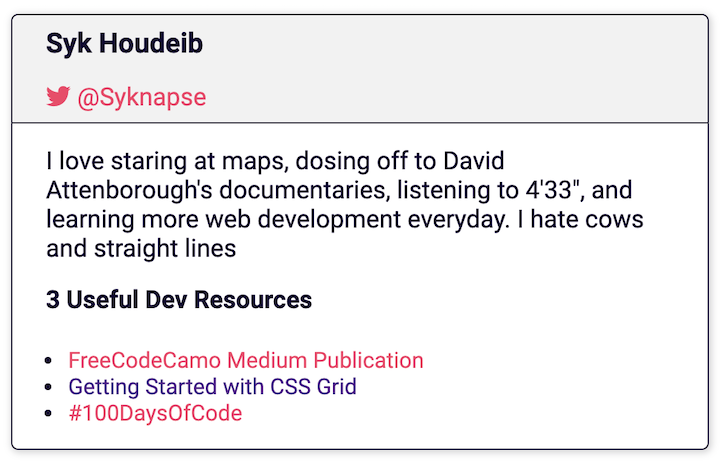
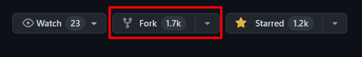
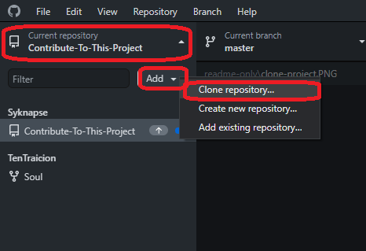
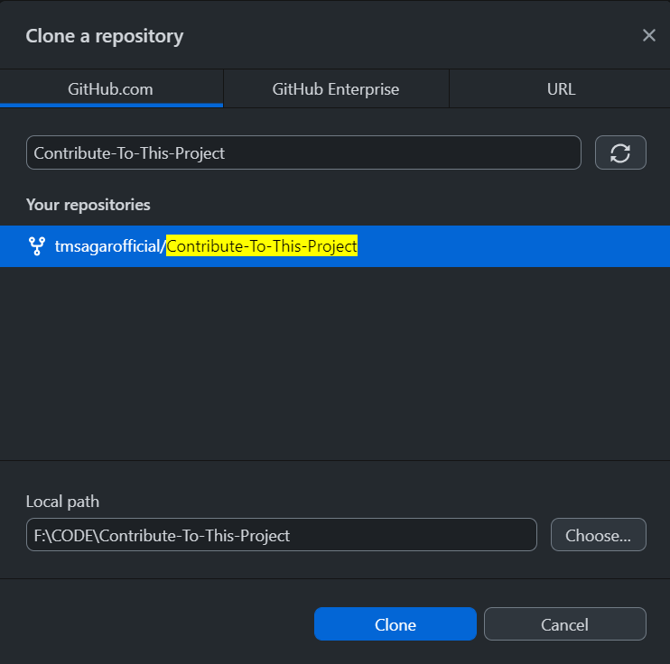
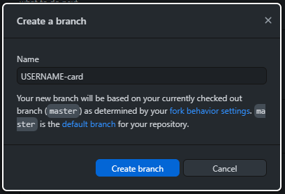
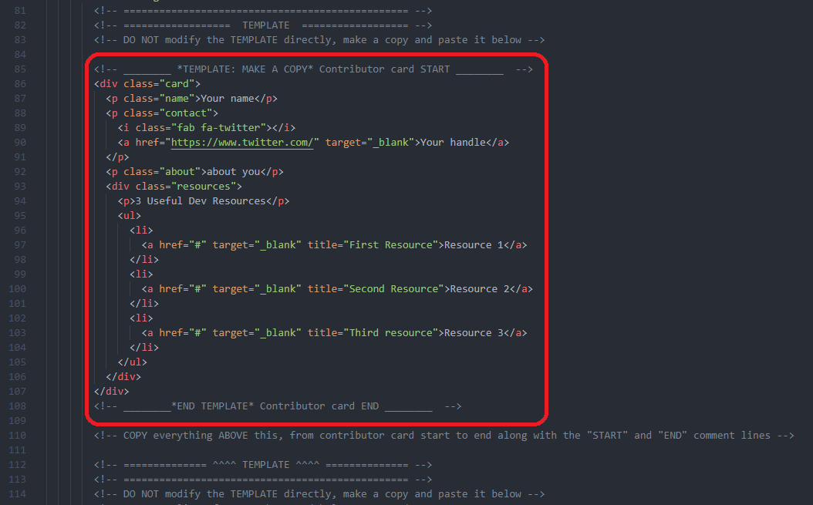
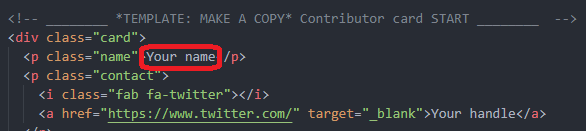
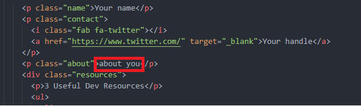

# [Contribute To This Project](https://syknapse.github.io/Contribute-To-This-Project/) 

## Introduction

This is a tutorial to help first-time contributors to participate in a simple and easy project.

### Objectives

+ Make a contribution to an open source project.
+ Get more comfortable using GitHub.

### Who is this for?

+ This is for absolute beginners. If you know how to write and edit an anchor tag `` then you should be able to do it.
+ It is for those with a little more experience but who want to make their first open source contribution, or get more contributions for more experience and confidence.

### Why do I need to do this?

Any web developer, aspiring or experienced needs to use Git version control, and GitHub is the most popular Git hosting service used by everyone. It is also the heart of the Open Source community. Getting comfortable using GitHub is an essential skill. Making a contribution to a project boosts your confidence and gives you something to show on your GitHub profile.

## What am I going to contribute?

You are going to contribute a card just like this one to this project's web page. It will include your name, a photo, your Twitter handle, a short description, and 3 links to useful resources for web developers that you recommend.

You will make a copy of the card template inside the HTML file and customise it with your own information.

## Setup

First let's get setup to do the work

1. Login to your GitHub account. If you don't yet have an account then [join GitHub](https://github.com/join). I recommend that you do the [GitHub Hello World tutorial](https://guides.github.com/activities/hello-world/) before you continue.
1. Download [GitHub Desktop app](https://desktop.github.com/).
    + Alternatively if you are comfortable using Git on the command line you can do so (here's [first-contributions](https://github.com/Syknapse/first-contributions), a similar project that can serve as a guide for the commands needed). OR 
    + If you use VS Code it comes with integrated Git and allows you to do what we need straight from the editor.
    + However the simplest and easiest way to follow this tutorial is using GitHub Desktop.

Now that you are all setup let's get on with the business of contributing to the project.

## Contribute

Become an open source contributor in 10 easy steps.

### Step 1: Fork this repository

| instructions |  |
|:---|---:|

### Step 2: Clone the repository

| instructions |  |
|:---|---:|

| instructions |  |
|:---|---:|

### Step 3: Create a new branch

| instructions |  |
|:---|---:|

| instructions |  |
|:---|---:|

### Step 4: Open the index.html file

| instructions |  |
|:---|---:|

### Step 5: Copy the card template

| instructions |  |
|:---|---:|

| instructions |  |
|:---|---:|

### Step 6: Apply your changes

| instructions |  |
|:---|---:|

| instructions |  |
|:---|---:|

| instructions |  |
|:---|---:|

| instructions |  |
|:---|---:|

| <ul><li>item1</li><li>item2</li></ul> |  |
|:---|---:|

### Step 7: Commit your changes

| instructions |  |
|:---|---:|

| instructions |  |
|:---|---:|

### Step 8: Push your changes to GitHub

| instructions |  |
|:---|---:|

### Step 9: Submit a PR

| instructions |  |
|:---|---:|

### Step 10: Celebrate!

That's it. You have done it! You have now contributed to open source on GitHub.

You have added code to a live web page: https://syknapse.github.io/Contribute-To-This-Project

Your changes **won't be visible immediatly**, first they have to be merged by the project maintainer. Once they are merged your card should be visible and live on the page. I will try to make the merges as soon as possible but a couple of days delay might be expected sometimes.

## Next Steps

+ Come back in a while to check for your merged Pull Request.
+ If you found this project useful please give it a star at the top of the page and Tweet about it to help spread the word 
+ You can follow me and get in touch on [Twitter](https://twitter.com/Syknapse "@Syknapse") or [using any of these other options](https://syknapse.github.io/Syk-Houdeib/#contact "My contact section | Portfolio")
+ This is an open source project so apart from contributing your card you are welcome to help fix bugs, improvements, or new features. Open an [issue](https://help.github.com/articles/creating-an-issue/ "Mastering Issues | GitHub Guides") or send a new [pull request](https://help.github.com/articles/creating-a-pull-request-from-a-fork/ "Creating a pull request from a fork | GitHub Help")
+ Thanks for contributing to this project. Now you can go ahead and try contributing to other projects; look for the first-contribu?? label

## Acknowledgements

This project is heavily influenced by [Peter Lazar's](https://github.com/peterlazar1993) great [first-contributions](https://github.com/Syknapse/first-contributions) project with it's excellent tutorial.

It is also particularly inspired by the great community around [#GoogleUdacityScholars](https://twitter.com/hashtag/GoogleUdacityScholars?src=hash) The Google Challenge Scholarship: Front-End Web Dev, class of 2017 Europe. 

## Licence

[MIT License](#)