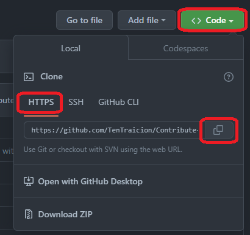
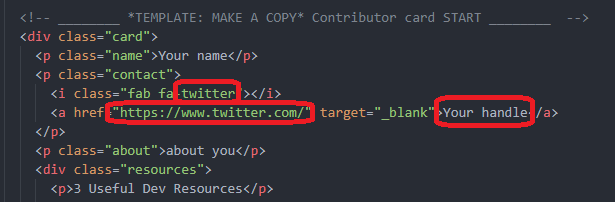
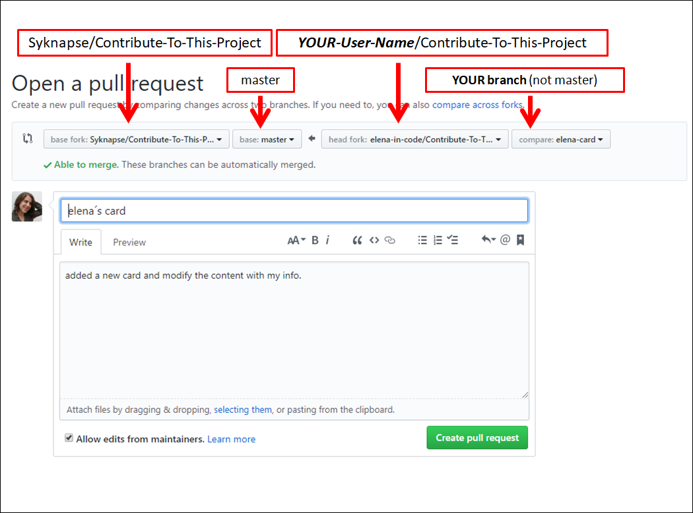
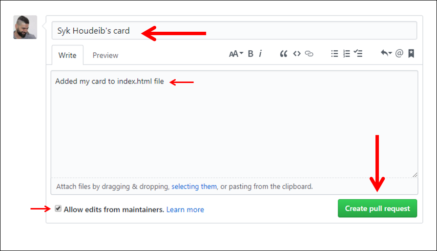

# [Contribute To This Project](https://syknapse.github.io/Contribute-To-This-Project/)

<kbd></kbd>

> Logo Created with :sparkling_heart: By [CandidDeer](https://github.com/CandidDeer)

[][twit]
[](https://discord.gg/tWkvS4ueVF 'Join our Discord server!')
[](https://syknapse.github.io/Contribute-To-This-Project/)
[](https://syknapse.github.io/Contribute-To-This-Project/)

---

> ## **Announcement:**
>
> Would you like to become a maintainer on this project and help keeping it going? If you are interested, read the [maintainer's guide](maintainer_guide.md) and send me a DM on [Twitter](https://twitter.com/Syknapse).

---

> ### Translations

This tutorial is also available in [other languages](translations/translation.md)

| 0   | 1                               | 2                                                                 |
| --- | ------------------------------- | ----------------------------------------------------------------- |
| 1   | [English](terminal-tutorial.md) | [Bangla](translations/terminal_tutorial/terminal_tutorial.ben.md) |

> Translations for projects documentations are welcome. Read [`Translation Guide`](translations/translation.md) to contribute.

---

> ## Introduction

Here we will learn how to contribute in this project or in GitHub/Git with _Terminal_. This is a tutorial to help first-time contributors to participate in a simple and easy project.

> ### Contribution Steps

- [Setup](#setup)
- [Step 1 Fork This Repository](#step-1-fork-this-repository)
- [Step 2 Clone the repository](#step-2-clone-the-repository)
- [Step 3 Create a new branch](#step-3-create-a-new-branch)
- [Step 4 Open the index.html file](#step-4-open-the-indexhtml-file)
- [Step 5 Copy the card template](#step-5-copy-the-card-template)
- [Step 6 Apply your changes](#step-6-apply-your-changes)
- [Step 7 Commit your changes](#step-7-commit-your-changes)
- [Step 8 Push your changes to github](#step-8-push-your-changes-to-github)
- [Step 9 Submit a PR(Pull Request)](#step-9-submit-a-prpull-request)
- [Step 10 Celebrate](#step-10-celebrate)
- [Next Steps](#next-steps)
- [Aknowledgements](#acknowledgements)

---

> #### Setup

First let's get setup to do the work.
If you're not good with the command line interface [here is the GUI tutorial using github desktop](./README.md)

- If you don't have git, [install it from here](https://git-scm.com/book/en/v2/Getting-Started-Installing-Git)

---

> #### Step 1 Fork this repository

- The objective here is to make a copy of this project and place it in your account.
- A repository (repo) is how a project is called on GitHub and a fork is a copy of it.
- Make sure you are on the [main page](https://github.com/Syknapse/Contribute-To-This-Project 'https://github.com/Syknapse/Contribute-To-This-Project') of this repo.

| Click on the _Fork_ button |  |
| :------------------------- | ----------------------------------------------: |


- You now have a complete copy of the project in your own account.

[↑ Go to top ↑](#contribution-steps)

---

> #### Step 2 Clone the repository



Now we want to make a local copy of the project. That is a copy saved on your own machine.

- Now clone this repo to your machine. Click on the clone button and then click the copy to clipboard icon.
- A repository (repo) is how a project is called on GitHub and a fork is a copy of it.

Open a terminal and run the following git command:

```bash
git clone "url you just copied"
```

For example:

```bash
git clone https://github.com/$Username/Contribute-To-This-Project.git
```

where `$Username` is your GitHub username. Here you're copying the contents of the first-contributions repository on GitHub to your computer.

[↑ Go to top ↑](#contribution-steps)

---

> #### Step 3 Create a new branch

Change to the repository directory on your computer (if you are not already there):

```bash
cd Contribute-To-This-Project
```

Now create a new branch using the `git checkout` command

```bash
git checkout -b your-new-branch-name
```

For example:

```bash
git checkout -b add-$Username-card
```

Note: Change `$Username` with your GitHub account Username.

**Do NOT work on the `master` branch**

- Now you have created a new branch separate from the master.
- For the next steps make sure you are working in this branch. You will see the name of the branch you are on at the bottom left of the text editor youre using where it says `$Username-card` as your branch name.

[↑ Go to top ↑](#contribution-steps)

---

> #### Step 4 Open the index.html file

Now we need to open the file we are going to edit with your favourite code editor. We are using [VSCode](https://code.visualstudio.com/) as our preferred code editor.

- The `index.html` file is directly in the `Contribute-To-This-Project` folder.
- Now you have the file you are going to edit open in your editor and you are ready to start making changes to it.
- You can open the file with the following command:

```bash
code index.html
```

Note: This is a terminal code to open the file: `index.html` in `VSCode`.

[↑ Go to top ↑](#contribution-steps)

---

> #### Step 5 Copy the card template

We will now make a copy of our card templates and make changes to it

- **At the top of the html file, under the `<head>` and `<header>` sections you will find the section labelled `== TEMPLATE ==`**
- **Copy everything within the red square in the image, from the `Contributor card START` comment to the `Contributor card END` comment**


- **Paste the whole thing directly below the comment indicating it**
- **Make sure there is a single line of space between your card start and the last card end. It's good practice to keep our code as clear as possible**
- **Never use a linters or style formatters. The project has Prettier setup**


- This now is **your** card for you to customize and edit.

[↑ Go to top ↑](#contribution-steps)

---

> #### Step 6 Apply your changes

We'll now start editing html, changing the customizable fields in our card.


- **Replace 'Name' with your name**
- **Note: Don't change `class="name"`**
- **Insert the URL of your Twitter account `href="Insert URL here"`**
- **Type your handle in the text field**



- **If you prefer to use a contact other than Twitter you will need to replace the twitter icon `<i class="fa fa-twitter"></i>` by going to [Font Awesome Icons](http://fontawesome.io/icons/) searching for the right icon and replacing only the `fa-twitter` part with the new icon like `fa-facebook` for example. Then follow the same steps above.**

> Tell us something about you


- **Keep it short and sweet. Think about it more like a tweet than a blog post**

- **Share with the community 3 links to resources that are useful for web development**
- **This can be anything, a video, a talk, a podcast, an article, a reference, or a tool**
- **If you are a beginner don't be intimidated by this, share whatever you know even if you think it's basic. You'll be surprised how many people will benefit**


- **Link: Insert the link `href="here"` replacing the `#`**
- **Title: Write a brief description `title="here"`**
- **Name: Write the resource's name in the text field `>here</a>`**

- Make sure you have **saved all your changes**.
- **Test your changes**. THIS IS IMPORTANT! Open the html file in your browser (by double clicking on it for example) and see what your card will look like on the site. See that the entire page still looks the same and nothing is broken. Click your links and make sure they are working. Open the console (Ctrl + Shift + J (Windows / Linux) or Cmd + Opt + J (Mac)) and check that there are no error messages.
- Great, you have finished editing your code! The next steps will send your changes to GitHub and then submit them to be merged with the main project.

[↑ Go to top ↑](#contribution-steps)

---

> #### Step 7 Commit your changes

- Now open the terminal in your project directory and run `git status` and you'll notice that there are no changes made in git.
- You can add those changes you made using the `git-add` command

```bash
git add index.html
```

- Now commit those changes using the `git commit` command

```bash
git commit -m "Add $Username card info"
```

- Replacing `$Username` with your Github Username.

[↑ Go to top ↑](#contribution-steps)

---

> #### Step 8 Push your changes to github

- Now that youve commited your changes, they are only saved locally in your local computer.
- Synchronizing local changes with your repository on GitHub is called a `Push`. You are "pushing" the changes from your local repository to the remote repository on GitHub.
- We use the `git push` command to push changes to github.

```bash
git push -u origin $Username-card
```

- Replacing `$Username-card` with your branch name.

- After a few seconds the operation is complete and now you have exactly the same copy of this branch on your machine as well as on GitHub.

[↑ Go to top ↑](#contribution-steps)

---

> #### Step 9 Submit a PR(Pull Request)

- This is the moment you have been waiting for; submitting a _Pull Request_ (PR).
- So far all the work you have done has been on the fork of the project, which as you remember resides on your own account of GitHub.
- Now it's time to send your changes to the main project to be merged with it.
- This is called a [_Pull Request_](https://help.github.com/articles/about-pull-requests/ 'About Pull Requests - GitHub Help') because you are asking the original project maintainer to "pull" your changes into their project.

- Go to the main page of **your fork** on GitHub (it will have the fork icon and your own user name at the top).
- Towards the top of the repo you will see a highlighted pull request message with a green button.


- **Click on the `Compare and pull request`**
- **This is what the `Open a pull request` page looks like.**
- **REMEMBER _you are trying to merge your branch with the original project not with the `Master` branch on your fork_.**
- **The image below gives you an idea of how the header of your pull request should look like.**
- **On the left is the original project, followed by the master branch. On the right is your fork and the branch you created.**





- Don't be fazed by all the options. You only need to do these three steps for now.
- Leave the option `Allow edits from maintainers` ticked.
- Now, a _Pull Request_ will be sent to the project maintainer. As soon as it is reviewed and accepted your changes will appear on the [project web page](https://syknapse.github.io/Contribute-To-This-Project 'Contribute To This Project web page').

[↑ Go to top ↑](#contribution-steps)

---

> #### Step 10 Celebrate

That's it. You have done it! You have now contributed to open source on GitHub.

You have added code to a live web page: [https://syknapse.github.io/Contribute-To-This-Project](https://syknapse.github.io/Contribute-To-This-Project)

Your changes **won't be visible immediately**; first they have to be reviewed, accepted, and merged by the project maintainer. Once they are merged your card should be visible and live on the page.

It is very normal for a reviewer to ask for changes on a PR. Think of it as good practice if it happens to you. Keep an eye for comments and requested changes. Once you make the requested changes (back in your branch) all you have to do is to commit and push your changes. The PR will automatically update with the new changes.

We promise we will try to review and merge as soon as possible but we do this in our spare time, so a few days delay is inevitable.

[↑ Go to top ↑](#contribution-steps)

---

> ### Next Steps

- Come back in a while to check for your merged Pull Request.
- You should receive an email from GitHub when your changes have been approved, or if additional changes are requested. And when the PR is finally merged with the master and your card has been added.
- If you found this project **useful** please give it a :star: star :star: at the top of the page and **Tweet** about it to help spread the word [][twit]
- You can **follow me** and get in touch on [Twitter](https://twitter.com/Syknapse '@Syknapse') or [using any of these other options](https://syknapse.github.io/Syk-Houdeib/#contact 'My contact section | Portfolio')
- This is an open source project so apart from contributing your card you are welcome to help fix bugs, improvements, or new features. Open an [issue](https://help.github.com/articles/creating-an-issue/ 'Mastering Issues | GitHub Guides') or send a new [pull request](https://help.github.com/articles/creating-a-pull-request-from-a-fork/ 'Creating a pull request from a fork | GitHub Help')
- To help improve our community take a look at the GitHub [Discussions](https://github.com/Syknapse/Contribute-To-This-Project/discussions) tab located next to Pull Requests. This area is a place to introduce yourself, go into deeper discussions on Open Source, and communicate with the Project Maintainers. Will you help us build out this feature and enhance our community?
- **Thanks for contributing to this project**. Now you can go ahead and try contributing to other projects; look for the  label for beginner-friendly contribution options.
- I'm also looking for collaborators to give me a hand in reviewing and merging PRs. If you would like to get more advanced Git practice please send me a DM on Twitter and read the [maintainer's guide](maintainer_guide.md).

[↑ Go to top ↑](#contribution-steps)

---

> ### Acknowledgements

This project is heavily influenced by [Roshan Jossey's](https://github.com/Roshanjossey) great [first-contributions](https://github.com/Roshanjossey/first-contributions) project with its excellent tutorial.

It is also particularly inspired by the great community around [#GoogleUdacityScholars](https://twitter.com/hashtag/GoogleUdacityScholars?src=hash) The Google Challenge Scholarship: Front-End Web Dev, class of 2017 Europe.

> ### Top 100 Contributors

[](https://github.com/Syknapse/Contribute-To-This-Project/graphs/contributors)

> ### [Back to the top &uparrow;](#introduction)

[twit]: https://twitter.com/intent/tweet?text=Contribute%20To%20This%20Project.%20An%20easy%20project%20for%20first-time%20contributors,%20with%20a%20full%20tutorial.%20By%20@Syknapse&url=https://github.com/Syknapse/Contribute-To-This-Project&hashtags=100DaysofCode 'Tweet this project'
