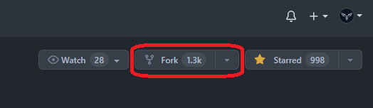

# [ساهم في هذا المشروع](https://syknapse.github.io/Contribute-To-This-Project/)

[](https://twitter.com/intent/tweet?text=%D8%B3%D8%A7%D9%87%D9%85%20%D9%81%D9%8A%20%D9%87%D8%B0%D8%A7%20%D8%A7%D9%84%D9%85%D8%B4%D8%B1%D9%88%D8%B9.%20%D9%85%D8%B4%D8%B1%D9%88%D8%B9%20%D8%B3%D9%87%D9%84%20%D9%84%D9%84%D9%85%D8%B3%D8%A7%D9%87%D9%85%D9%8A%D9%86%20%D9%84%D8%A3%D9%88%D9%84%20%D9%85%D8%B1%D8%A9%D8%8C%20%D9%85%D8%B9%20%D8%AF%D9%84%D9%8A%D9%84%20%D9%85%D9%81%D8%B5%D9%84%20%D8%A8%D8%A7%D9%84%D8%AE%D8%B7%D9%88%D8%A7%D8%AA.%20%D9%85%D9%82%D8%AF%D9%85%20%D9%85%D9%86%20%40Syknapse%20https%3A%2F%2Fgithub.com%2FSyknapse%2FContribute-To-This-Project%20%23100DaysofCode%0A 'غرد عن هذا المشروع')

> **إعلان:** أترغب في أن تكون مشرفاً في هذا المشروع وتعين على إستمراريته؟ إن كنت مهتما أرسل لي رسالة خاصة على [Twitter](https://twitter.com/Syknapse) واقرأ [دليل المشرفين](maintainer_guide.md).

## مقدمة

هذا دليل تعليمي لمساعدة المساهمين لأول مرة للمشاركة في مشروع سهل وبسيط.

هذا الدليل متوفر أيضاً [بلغات أخرى](https://github.com/Syknapse/Contribute-To-This-Project/tree/master/translations) ([البرتغالية](https://github.com/Syknapse/Contribute-To-This-Project/blob/master/translations/PORTUGUESE.md), [الإسبانية](https://github.com/Syknapse/Contribute-To-This-Project/blob/master/translations/SPANISH.md), و [الإيطالية](https://github.com/Syknapse/Contribute-To-This-Project/blob/master/translations/ITALIAN.md) في الوقت الحالي. نرحب بالترجمات).

### الأهداف

- المساهمة في مشروع مفتوح المصدر.
- الإعتياد على التعامل مع GitHub.

### لمن هذا الدليل؟

- هذا الدليل للمبتدئين جداً. إن كنت تعرف كيف تكتب وتعدل على وسم الروابط `` فيمكنك فعلها.
- إنه لأولئك الذين لديهم القليل من الخبرة ويرغبون في تسجيل أول مساهمة لهم في المصدر المفتوح، أو تسجيل مساهمات أكثر للمزيد من الخبرة أو لاكتساب الثقة.

### لماذا علي القيام بذلك؟

أي مبرمج ويب صاعد أو خبير يحتاج لاستخدام نظام إصدارات قيت (git version control)، و GitHub هو خدمة الإستضافة الأشهر لمشاريع Git والذي يستخدمه الجميع. هو كذلك القلب النابض لمجتمع المصدر المفتوح. الإعتياد على استعمال GitHub مهارة لا غنى عنها. المساهمة في مشروع مفتوح المصدر يعطيك دفعة من الثقة ومادة يمكنك عرضها على صفحتك الشخصية على GitHub. 

إن كنت مبرمجاً جديداً وتتسائل إن كان يجب عليك أن تتعلم Git و GitHub ففي المقال التالي تجد الإجابة: [You Should've Learned Git Yesterday](https://codeburst.io/number-one-piece-of-advice-for-new-developers-ddd08abc8bfa 'New Developer? You should’ve learned Git yesterday. by Brandon Morelli, creator of CodeBurst.io').

## بم سأساهم؟

سوف تساهم بكرت كهذا تماماً على [صفحة الويب لهذا المشروع](https://syknapse.github.io/Contribute-To-This-Project/ 'https://syknapse.github.io/Contribute-To-This-Project'). سيحتوي الكرت على اسمك، معرف تويتر الخاص بك، وصف مختصر، و 3 روابط لمصادر من ترشيحك لمطوري الويب.

ستقوم بعمل نسخة من كود الكرت داخل ملف ال HTML وتخصيصه بعلوماتك الخاصة.

## فهرس الوصول السريع

| <ul><li>[المقدمة](#Introduction)</li><li>[بم سأساهم؟](#what-am-i-going-to-contribute)</li><li>[التجهيز](#setup)</li><li>[المساهمة &rightarrow;](#contribute)</li><li>[الخطوات التالية](#next-steps)</li><li>[شكر وعرفان](#acknowledgements)</li></ul> | المساهمة: <ul><li>[الخطوة الأولى: انسخ (fork) هذا المستودع](#step-1-fork-this-repository)</li><li>[الخطوة الثانية: انسخ (clone) هذا المستودع](#step-2-clone-the-repository)</li><li>[الخطوة الثالثة: أنشئ تفرعاً جديداً](#step-3-create-a-new-branch)</li><li>[الخطوة الرابعة: افتح ملف index.html](#step-4-open-the-indexhtml-file)</li><li>[الخطوة الخامسة: انسخ كود الكرت](#step-5-copy-the-card-template)</li><li>[الخطوة السادسة: نفذ تعديلاتك](#step-6-apply-your-changes)</li><li>[الخطوة السابعة: قم بعمل commit لتغييراتك](#step-7-commit-your-changes)</li><li>[الخطوة الثامنة: ادفع بتغييراتك ل GitHub](#step-8-push-your-changes-to-github)</li><li>[الخطوة التاسعة: قم بتقديم Pull Request](#step-9-submit-a-pr)</li><li>[الخطوة العاشرة: وقت الإحتفال!](#step-10-celebrate)</li></ul> |
| :------------------------------------------------------------------------------------------------------------------------------------------------------------------------------------------------------------------------------------------------------------------------------ | :------------------------------------------------------------------------------------------------------------------------------------------------------------------------------------------------------------------------------------------------------------------------------------------------------------------------------------------------------------------------------------------------------------------------------------------------------------------------------------------------------------------------------------------------------------------------------------------------------------------------------------------------------------------------------------------------------------------ |

## التجهيز! :)

في البداية، لنتجهز لبدء العمل

1. سجل الدخول لحسابك على GitHub. إن لم تقم بعد بإنشاء حساب فقم [بالإنضمام](https://github.com/join). أنصحك باتباع [دليل البداية من GitHub](https://guides.github.com/activities/hello-world/) قبل الإستمرار.
1. قم بتحميل [GitHub لسطح المكتب](https://desktop.github.com/).
   - كخيار آخر، إن كنت ترتاح لاستخدام Git على ال command line فيمكنك استخدامه (هنا تجد [المساهمين لأول مرة](https://github.com/Syknapse/first-contributions), مشروعاً مشابهاً يمكن أن يكون دليلاً للأوامر المطلوبة.) وكخيار ثالث...
   - إن كنت تستخدم محرر [VS Code](https://code.visualstudio.com/ 'Visual Studio Code website') فهو يأتي مع نظام Git مدمجاً ويسمح لك بتنفيذ ما نريده مباشرة من داخل البرنامج.
   - وعلى كل حال، الطريقة الأبسط لاتباع هذا الدليل هي استخدام GitHub لسطح المكتب.

الآن وقد تجهزت، لنبدأ عملية المساهمة في هذا المشروع.

---

---

## المساهمة

تحول لمساهم في المصدر المفتوح عبر 10 خطوات بسيطة.

_الوقت المقدر: أقل من 30 دقيقة_.

### الخطوة الأولى: انسخ (Fork) هذا المستودع

- الهدف هنا هو عمل نسخة من هذا المشروع ووضعها في حسابك الشخصي.
- المستودع (repo) هو الإسم الذي يطلق على أي مشروع في GitHub وال fork هي نسخة منه.
- تأكد من أنك في [الصفحة الرئيسية](https://github.com/Syknapse/Contribute-To-This-Project 'https://github.com/Syknapse/Contribute-To-This-Project') لهذا المشروع.

| <ul><li>اضغط على زر _Fork_</li></ul> |  |
| :------------------------------------------- | ----------------------------------------------: |

- لديك الآن نسخة كاملة من المشروع على حسابك الخاص.

---

### الخطوة الثانية: انسخ (Clone) هذا المستودع

- الآن نريد عمل نسخة محلية من المشروع. هذا يعني نسخة من المشروع محفوظة على جهازك الشخصي.
- افتح تطبيق GitHub لسطح المكتب. في التطبيق:

| <ul><li>اضغط على _File_ ثم _Clone repository_</li></ul> |  |
| :-------------------------------------------------------- | -------------------------------------------------------: |

| <ul><li>سترى قائمة من مشاريعك ونسخاتك على GitHub.</li><li>اختر `<your-github-username>/Contribute-To-This-Project`.</li><li>اضغط على _Clone_</li></ul> |  |
| :-------------------------------------------------------------------------------------------------------------------------------------------------------------------- | :----------------------------------------------------------------------------------------------------------: |
| <ul><li>المشاريع المستنسخة ستملك أيقونة النسخ (fork) على يسارها</li><li>نسختك ستكون تحت اسم حسابك الشخصي</li></ul>                                      |        |

- سيستغرق الأمر بعض الوقت ريثما يتم نسخ المشروع إلى القرص الخاص بك. أنصحك بترك المسار الافتراضي كما هو والذي هو عادة `..\Documents\GitHub`.
- الآن لديك نسخة محلية من المشروع.

---

### Step 3: Create a new branch

- Once the repo has been cloned and you have it open in GitHub desktop it is time to create a new branch.
- A branch is a way to keep your changes separate from the main part of the project called `Master`. For example if things go wrong and you are not happy with your changes you can simply delete the branch and the main project won't be affected.

| <ul><li>Click on _Current branch_</li><li>Then click on _New_</li></ul> |  |
| :---------------------------------------------------------------------- | ---------------------------------------------------------------------------: |

| <ul><li>Give your branch a name</li><li>Click `Create branch`</li></ul> |  |
| :---------------------------------------------------------------------- | -------------------------------------------------------------: |

- You can name it whatever you want, but since this is a branch to add a card with your name to the project, calling it `your-name-card` is good practice because it keeps the intention of this branch clear.

| <ul><li>Publish your new branch to Github</li></ul> |  |
| :-------------------------------------------------- | ------------------------------------------------------------------------------------------------------------------: |

- Now you have created a new branch separate from the master.
- For the next steps make sure you are working in this branch. You will see the name of the branch you are on at the top center of the GitHub desktop app where it says _Current branch_.

**Do NOT work on the `master` branch**

---

### Step 4: Open the index.html file

- Now we need to open the file we are going to edit with your favourite code editor.
- Find the project folder on your computer. If you have kept the default this should be something like `your-computer > Documents > GitHub > Contribute-To-This-Project`
- The `index.html` file is directly in the `Contribute-To-This-Project` folder.

| <ul><li>Open your code editor (Sublime, VS Code, Atom..etc) and use the `Open file` command and locate the index.html file in the main directory of the project</li><li>Alternatively you can locate the file on your hard drive, right click, and open with your editor</li></ul> |  |
| :--------------------------------------------------------------------------------------------------------------------------------------------------------------------------------------------------------------------------------------------------------------------------------- | -----------------------------------------------------------------------------------: |

- Now you have the file you are going to edit open in your editor and you are ready to start making changes to it.

---

### Step 5: Copy the card template

- We will make a copy of the card template to start working on it

| <ul><li>At the top of the html file, under the `<head>` and `<header>` sections you will find the section labelled `== TEMPLATE ==`</li><li>Copy everything within the red square in the image, from the `Contributor card START` comment to the `Contributor card END` comment</li></ul> |
| :---------------------------------------------------------------------------------------------------------------------------------------------------------------------------------------------------------------------------------------------------------------------------------------- |
|                                                                                                                                                                                                                  |

| <ul><li>Paste the whole thing directly below the comment indicating it</li><li>Make sure there is a single line of space between your card start and the last card end. It's good practice to keep our code as clear as possible</li><li>Never use a linters or style formatters. The project has Prettier setup</li></ul> |
| :------------------------------------------------------------------------------------------------------------------------------------------------------------------------------------------------------------------------------------------------------------------------------------------------------------------------- |
|                                                                                                                                                                                                                                         |

- This now is **your** card for you to customise and edit.

---

### Step 6: Apply your changes

- We'll  now start editing html, changing the customizable fields in our card.

| <ul><li>Replace 'Name' with your name</li><li>Note: Don't change `class="name"`</li></ul> |  |
| :---------------------------------------------------------------------------------------- | -----------------------------------------------------------: |

| <ul><li>Insert the URL of your Twitter account `href="Insert URL here"`</li><li>Type your handle in the text field</li></ul> |
| :--------------------------------------------------------------------------------------------------------------------------- |
|                |

- If you prefer to use a contact other than Twitter you will need to replace the twitter icon `<i class="fa fa-twitter"></i>` by going to [Font Awesome Icons](http://fontawesome.io/icons/) searching for the right icon and replacing only the `fa-twitter` part with the new icon like `fa-facebook` for example. Then Follow the same steps above.

| <ul><li>Tell us something about you</li><li>Keep it short and sweet. Think about it more like a tweet than a blog post</li></ul> |  |
| :------------------------------------------------------------------------------------------------------------------------------- | -------------------------------------------------------------------------: |

| <ul><li>Share with the community 3 links to resources that are useful for web development</li><li>This can be anything, a video, a talk, a podcast, an article, a reference, or a tool</li><li>If you are a beginner don't be intimidated by this, share whatever you know even if you think it's basic. You'll be surprised how many people will benefit</li></ul> |
| :------------------------------------------------------------------------------------------------------------------------------------------------------------------------------------------------------------------------------------------------------------------------------------------------------------------------------------------------------------------ |
|                                                                                                                                                                                                                                    |
| <ul><li>Link: Insert the link `href="here"` replacing the `#`</li><li>Title: Write a brief description `title="here"`</li><li>Name: Write the resource's name in the text field `>here</a>`</li></ul>                                                                                                                                                               |

- Make sure you have **saved all your changes**.
- **Test your changes**. THIS IS IMPORTANT! Open the html file in your browser (by double clicking on it for example) and see what your card will look like on the site. See that the entire page still looks the same and nothing is broken. Click your links and make sure they are working. Open the console (Ctrl + Shift + J (Windows / Linux) or Cmd + Opt + J (Mac)) and check that there are no error messages.
- Great, you have finished editing your code! The next steps will send your changes to GitHub and then submit them to be merged with the main project.

---

### Step 7: Commit your changes

- Go back to the GitHub desktop app.
- Your changes will have been added automatically to the staging area.
- This means that Git has recorded all the **saved** changes.
- You can see this reflected in the app. Everything you have added to the file will be in green, and deletions will show as red.

| <ul><li>The next step is called _Commit_</li><li>This roughly means "confirm the changes"</li></ul> |  |
| :-------------------------------------------------------------------------------------------------- | ---------------------------------------------------------------------------------------------------------------------------------------------------------------------------: |

| <ul><li>This is what your GitHub desktop header should look like</li><li>Notice the fork symbol next to the project name in `Current repository`</li><li>Your `Current branch` will have the name you gave it in step 3</li></ul> |
| :-------------------------------------------------------------------------------------------------------------------------------------------------------------------------------------------------------------------------------- |
|                                                |

| <ul><li>To _Commit_ you must fill in the _Summary_ field</li><li>This is the commit message explaining what you have changed</li><li>In this case "Add my card information" would be a reasonable message</li><li>Optionally you can add a more detailed _Description_</li><li>Click the _Commit_ button. Your button will say something like `Commit to "your-branch-name"`</li></ul> |  |
| :--------------------------------------------------------------------------------------------------------------------------------------------------------------------------------------------------------------------------------------------------------------------------------------------------------------------------------------------------------------------------------------- | -------------------------------------------------------------------------------------------------------------------------------------------: |

---

### Step 8: Push your changes to GitHub

- Your changes are now saved or committed. But they are saved only locally, that is on your computer.
- Synchronizing local changes with your repository on Github is called a _Push_. You are "pushing" the changes from your local repository to the remote repository on Github.

| <ul><li>Click the _Push_ button</li></ul> |  |
| :---------------------------------------- | ------------------------------------------------------------------------------------------------: |

- After a few seconds the operation is complete and now you have exactly the same copy of this branch on your machine as well as on GitHub.

---

### Step 9: Submit a PR(Pull Request)

- This is the moment you have been waiting for; submitting a _Pull Request_ (PR).
- So far all the work you have done has been on the fork of the project, which as you remember resides on your own account of GitHub.
- Now it's time to send your changes to the main project to be merged with it.
- This is called a [_Pull Request_](https://help.github.com/articles/about-pull-requests/ 'About Pull Requests - GitHub Help') because you are asking the original project maintainer to "pull" your changes into their project.
- Go to the main page of **your fork** on GitHub (it will have the fork icon and your own user name at the top).
- Towards the top of the repo you will see a highlighted pull request message with a green button.

| <ul><li>Click on the `Compare and pull request`</li></ul> |  |
| :-------------------------------------------------------- | ------------------------------------------------------------------------------------------------------------------------------------------------------------------: |

| <ul><li>This is what the `Open a pull request` page looks like.</li><li>REMEMBER _you are trying to merge your branch with the original project not with the `Master` branch on your fork_.</li><li>The image below gives you an idea of how the header of your pull request should look like.</li><li>On the left is the original project, followed by the master branch. On the right is your fork and the branch you created.</li></ul> |
| :----------------------------------------------------------------------------------------------------------------------------------------------------------------------------------------------------------------------------------------------------------------------------------------------------------------------------------------------------------------------------------------------------------------------------------------- |
|                                                                                                                                                                                                                                                                       |

| <ul><li>Create a pull request:</li><li>Write a title</li><li>Add optional information in the description</li><li>Click `Create pull request`</li></ul> |  |
| :----------------------------------------------------------------------------------------------------------------------------------------------------- | -----------------------------------------------------------------------------------------------------: |

- Don't be fazed by all the options. You only need to do these three steps for now.
- Leave the option `Allow edits from maintainers` ticked.
- Now, a _Pull Request_ will be sent to the project maintainer. As soon as it is reviewed and accepted your changes will appear on the [project web page](https://syknapse.github.io/Contribute-To-This-Project 'Contribute To This Project web page').

---

### Step 10: Celebrate!!

That's it. You have done it! You have now contributed to open source on GitHub.

You have added code to a live web page: [https://syknapse.github.io/Contribute-To-This-Project](https://syknapse.github.io/Contribute-To-This-Project)

Your changes **won't be visible immediately**; first they have to be reviewed, accepted, and merged by the project maintainer. Once they are merged your card should be visible and live on the page.

It is very normal for a reviewer to ask for changes on a PR. Think of it as good practice if it happens to you. Keep an eye for comments and requested changes. Once you make the requested changes (back in your branch) all you have to do is to commit and push your changes. The PR will automatically update with the new changes.

I promise I will try to review and merge as soon as possible but I do this in my spare time, so a few days delay is inevitable.

---

---

## Next Steps

- Come back in a while to check for your merged Pull Request.
- You should receive an email from GitHub when your changes have been approved, or if additional changes are requested. And when the PR is finally merged with the master and your card has been added.
- If you found this project **useful** please give it a :star: star :star: at the top of the page and **Tweet** about it to help spread the word 
- You can **follow me** and get in touch on [Twitter](https://twitter.com/Syknapse '@Syknapse') or [using any of these other options](https://syknapse.github.io/Syk-Houdeib/#contact 'My contact section | Portfolio')
- This is an open source project so apart from contributing your card you are welcome to help fix bugs, improvements, or new features. Open an [issue](https://help.github.com/articles/creating-an-issue/ 'Mastering Issues | GitHub Guides') or send a new [pull request](https://help.github.com/articles/creating-a-pull-request-from-a-fork/ 'Creating a pull request from a fork | GitHub Help')
- To help improve our community take a look at the Github [Discussions](https://github.com/Syknapse/Contribute-To-This-Project/discussions) tab located next to Pull Requests. This area is a place to introduce yourself, go into deeper discussions on Open Source, and communicate with the Project Maintainers. Will you help us build out this feature and enhance our community?
- **Thanks for contributing to this project**. Now you can go ahead and try contributing to other projects; look for the  label for beginner-friendly contribution options.
- I'm also looking for collaborators to give me a hand in reviewing and merging PRs. If you would like to get more advanced Git practice please send me a DM on Twitter and read the [maintainer's guide](maintainer_guide.md).

## Acknowledgements

This project is heavily influenced by [Roshan Jossey's](https://github.com/Roshanjossey) great [first-contributions](https://github.com/Roshanjossey/first-contributions) project with its excellent tutorial.

It is also particularly inspired by the great community around [#GoogleUdacityScholars](https://twitter.com/hashtag/GoogleUdacityScholars?src=hash) The Google Challenge Scholarship: Front-End Web Dev, class of 2017 Europe.

## License

[MIT License](https://github.com/Syknapse/Contribute-To-This-Project/blob/master/LICENSE)

[Back to the top &uparrow;](#introduction)
