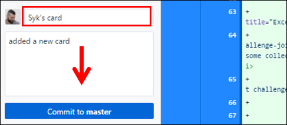

# [ساهم في هذا المشروع](https://syknapse.github.io/Contribute-To-This-Project/)

> الشعار أعلاه من إنشاء: [CandidDeer](https://github.com/CandidDeer) :sparkling_heart:

[][twit]

---

> ## **إعلان:**
>
> هل أنت مهتم بالانضمام إلى مشروعنا للمساعدة في إدارته وصيانته؟ يرجى قراءة [دليل الصيانة](../maintainer_guide/maintainer_guide.ben.md) وإرسال رسالة لي على [تويتر](https://twitter.com/Syknapse).

---

### جدول المحتويات

#### عام

- [إعلان](#إعلان)
- [مقدمة](#مقدمة)
- [لمن هذا؟](#لمن-هذا؟)
- [لماذا يجب أن أفعل ذلك؟](#لماذا-يجب-أن-أفعل-ذلك؟)
- [ماذا سأفعل هنا؟](#ماذا-سأفعل-هنا؟)
- [الترجمات](#الترجمات)
- [الإعداد!](#الإعداد-)
- [الخطوات التالية](#الخطوات-التالية)
- [شكر وتقدير](#شكر-وتقدير)

#### الخطوات

- [ساهم](#ساهم)
- [الخطوة 1: اعمل تفرع (Fork) لهذا المستودع](#الخطوة-1-اعمل-تفرع-fork-لهذا-المستودع)
- [الخطوة 2: استنسخ (Clone) المستودع](#الخطوة-2-استنسخ-clone-المستودع)
- [الخطوة 3: أنشئ فرعًا جديدًا (Branch)](#الخطوة-3-أنشئ-فرعًا-جديدًا-branch)
- [الخطوة 4: افتح ملف index.html](#الخطوة-4-افتح-ملف-indexhtml)
- [الخطوة 5: انسخ قالب البطاقة](#الخطوة-5-انسخ-قالب-البطاقة)
- [الخطوة 6: قم بإجراء التغييرات اللازمة](#الخطوة-6-قم-بإجراء-التغييرات-اللازمة)
- [الخطوة 7: قم بتثبيت (Commit) تغييراتك](#الخطوة-7-قم-بتثبيت-commit-تغييراتك)
- [الخطوة 8: ادفع (Push) التغييرات إلى GitHub](#الخطوة-8-ادفع-push-التغييرات-إلى-github)
- [الخطوة 9: أرسل طلب سحب (Pull Request)](#الخطوة-9-أرسل-طلب-سحب-pull-request)
- [الخطوة 10: احتفل!](#الخطوة-10-احتفل)

---

## مقدمة

هذا دليل لمساعدة المبتدئين في GitHub على المساهمة في مشروع سهل.

### الأهداف

- المساهمة في مشروع مفتوح المصدر.
- تسهيل استخدام GitHub.

### لمن هذا؟

- هذا للمبتدئين تمامًا. إذا كنت تعرف كيفية كتابة وتحرير وسم الارتساء ``، فستتمكن من المساهمة هنا.
- يمكن للمتمرسين أيضًا المساهمة هنا، ولكن هذا المشروع موجه أيضًا لمن يرغبون في تقديم مساهمتهم الأولى في المصدر المفتوح وبناء خبرتهم وثقتهم.

### لماذا يجب أن أفعل ذلك؟

يجب على أي مطور ويب أن يكتسب الكفاءة في Git، و GitHub هي خدمة استضافة Git الأكثر شيوعًا المستخدمة من قبل الجميع. إنها جذور منصة المصدر المفتوح. معرفة كيفية استخدام GitHub هي مهارة أساسية. بالإضافة إلى ذلك، فإن المساهمة في مشروع على GitHub تساعد على بناء الثقة.

إذا كنت مطورًا جديدًا وكنت تتساءل عما إذا كنت بحاجة إلى تعلم Git و GitHub، فالإجابة هي: [كان يجب أن تتعلم Git بالأمس](https://codeburst.io/number-one-piece-of-advice-for-new-developers-ddd08abc8bfa 'مطور جديد؟ كان يجب أن تتعلم Git بالأمس. براندون موريللي، مؤسس CodeBurst.io').

### ماذا سأفعل هنا؟

أنت على وشك إضافة بطاقة عنك إلى [موقع مشروعنا](https://syknapse.github.io/Contribute-To-This-Project/ 'https://syknapse.github.io/Contribute-To-This-Project') تبدو مثل هذه الصورة. ستتضمن اسمك، ملفك الشخصي على تويتر، وصفًا موجزًا، و 3 روابط لموارد مفيدة لمطوري الويب التي توصي بها.

ستقوم بإنشاء نسخة من قالب البطاقة داخل ملف HTML وتعبئتها بمعلوماتك الخاصة.

---

### الترجمات

يتوفر هذا الدليل أيضًا [بلغات أخرى](../README.md).

|     [العربية](README/ARABIC.md)     |   [البنغالية](README/BANGLA.md)   |     [الإنجليزية](../README.md)     |  [الفرنسية](README/FRENCH.md)   | [الألمانية](README/German.md) |
| :------------------------------: | :---------------------------: | :----------------------------: | :----------------------------: | :--------------------------: |
|    [الهندية](README/HINDI.md)     | [الإيطالية](README/ITALIAN.md) | [اليابانية](README/JAPANESE.md)  |  [الكورية](README/KOREAN.md)   |  [البولندية](README/POLISH.md)   |
| [البرتغالية](README/PORTUGUESE.md) | [الروسية](README/RUSSIAN.md)  | [الصربية](README/SERBIAN.md) | [الإسبانية](README/SPANISH.md) | [التركية](README/TURKISH.md)  |

> نرحب ترحيبا حارا بترجمة وثائق مشروعنا إلى لغات مختلفة. للمساهمات المتعلقة بالترجمة: يرجى قراءة [`المساعدة في الترجمة`](../README.md).

---

### الإعداد! :)

ملاحظة: هذا الدليل مخصص لـ GitHub Desktop. [إذا كنت تفضل استخدام المحطة الطرفية، فانقر هنا.](../terminal_tutorial/terminal_tutorial.ben.md)

لنستعد للقيام بذلك أولاً.

- سجل الدخول إلى حسابك على GitHub. إذا لم يكن لديك حساب، [قم بإنشاء حساب](https://github.com/join). قبل المتابعة، أكمل [دليل GitHub Hello World](https://guides.github.com/activities/hello-world/).
- قم بتنزيل [برنامج GitHub Desktop](https://desktop.github.com/).
  - بدلاً من ذلك، إذا كنت تفضل استخدام Git في سطر الأوامر، فيمكنك القيام بذلك [هنا رابط لدليل CLI](../../terminal-tutorial.md).
  - إذا كنت تستخدم [VS Code](https://code.visualstudio.com/ 'موقع Visual Studio Code'), فإنه يأتي مع Git مدمجًا ويتيح لك القيام بما تحتاجه مباشرة من المحرر.
  - ومع ذلك، فإن أسهل طريقة لمتابعة هذا الدليل هي استخدام GitHub Desktop.

> الآن بعد أن انتهيت من الإعداد، لنبدأ بالعمل على المشروع.

[↑ العودة إلى الأعلى ↑](#جدول-المحتويات)

---

### ساهم

كن مساهمًا في المصدر المفتوح في 10 خطوات سهلة.

_الوقت المقدر: أقل من 30 دقيقة._

#### الخطوة 1: اعمل تفرع (Fork) لهذا المستودع

- الفكرة هنا هي إنشاء نسخة من هذا المشروع ووضعها في حسابك.
- المستودع (Repo) هو مشروع على GitHub، والتفرع (Fork) هو نسخة من المشروع.
- تأكد أنك على [الصفحة الرئيسية](https://github.com/Syknapse/Contribute-To-This-Project 'https://github.com/Syknapse/Contribute-To-This-Project') لهذا المستودع.

| في الجزء العلوي من هذه الصفحة، انقر على زر _Fork_. |  |
| :---------------------------------------------------- | ---------------------------------------------------------: |

- الآن لديك نسخة كاملة من هذا المشروع في حسابك الخاص.

  [↑ العودة إلى الأعلى ↑](#جدول-المحتويات)

---

#### الخطوة 2: استنسخ (Clone) المستودع

- الآن نريد عمل نسخة محلية من هذا المشروع. إنها نسخة مخزنة على جهاز الكمبيوتر الخاص بك.
- افتح برنامج GitHub Desktop. في التطبيق:

| أولاً انقر على قائمة _File_ ثم على _Clone repository_. |  |
| :-------------------------------------------------------------- | ------------------------------------------------------------------------: |

| سترى قائمة بمشاريعك وتفرعاتك على GitHub. اختر `<اسم مستخدم GitHub الخاص بك>/Contribute-To-This-Project`. انقر على _Clone_. |  |
| :---------------------------------------------------------------------------------------------------------------------------------------------------------------------------- | :-------------------------------------------------------------------------------------------------------------------------: |
| **سيكون للمشروع المتفرع رمز تفرع على اليسار. سيكون لفرعك اسم مستخدم GitHub الخاص بك.**                                                |                        |

- سيستغرق الأمر بعض الوقت لنسخ المشروع إلى القرص الصلب الخاص بك. من الأفضل عدم تغيير الدليل عند الاستنساخ. والذي عادة ما يكون `..\Documents\GitHub`.
- الآن لديك نسخة من المشروع على جهاز الكمبيوتر الخاص بك.

  [↑ العودة إلى الأعلى ↑](#جدول-المحتويات)

---

#### الخطوة 3: أنشئ فرعًا جديدًا (Branch)

- بمجرد استنساخ المستودع، سيفتح تلقائيًا في GitHub Desktop الخاص بك. حان الوقت الآن لإنشاء فرع جديد.
- الفرع (Branch) هو طريقة لفصل تغييراتك عن الجزء الرئيسي من المشروع، والذي يسمى `master`. على سبيل المثال، إذا حدث خطأ ما ولم تكن راضيًا عن تغييراتك، فيمكنك ببساطة حذف الفرع ولن يتأثر المشروع الأصلي.

| انقر على _Current branch_. ثم انقر على _New_. |  |
| :-------------------------------------------------------- | -----------------------------------------------------------------------------------------------------: |

| امنح الفرع اسمًا. انقر على `Create branch`. |  |
| :------------------------------------------------------------ | ------------------------------------------------------------------------: |

- يمكنك تسمية هذا الفرع أي شيء تريده، ولكن بما أنه فرع لإضافة بطاقة باسمك إلى المشروع، فمن الممارسات الجيدة تسميته `اسمك-بطاقة` لأنه يوضح الغرض من هذا الفرع.

| أعلن عن فرعك الجديد في GitHub. |  |
| :----------------------------------- | ------------------------------------------------------------------------------------------------------------------------------------: |

- الآن قمت بإنشاء فرع جديد منفصل عن `master`.
- للخطوات التالية، تأكد من أنك تعمل على هذا الفرع. سترى اسم الفرع الذي أنت فيه في الجزء العلوي من تطبيق GitHub Desktop أسفل _Current Branch_.

**لا تعمل على فرع `master`.**

[↑ العودة إلى الأعلى ↑](#جدول-المحتويات)

---

#### الخطوة 4: افتح ملف index.html

- تحتاج الآن إلى فتح محرر الأكواد الذي تفضل استخدامه لتحرير الملف.
- ابحث عن مجلد المشروع على جهاز الكمبيوتر الخاص بك. إذا احتفظت بالإعدادات الافتراضية، فيجب أن يكون شيئًا مثل: `جهاز الكمبيوتر الخاص بك > المستندات > GitHub > Contribute-To-This-Project`
- ملف `index.html` موجود مباشرة في مجلد `Contribute-To-This-Project`.

| افتح محرر الأكواد الخاص بك (Sublime, VS Code, Atom..إلخ) واستخدم أمر `Open file` لتحديد موقع ملف `index.html` في الدليل الرئيسي للمشروع. بدلاً من ذلك، يمكنك العثور على الملف على القرص الصلب الخاص بك، والنقر بزر الماوس الأيمن وفتحه في محرر الأكواد الخاص بك. |  |
| :----------------------------------------------------------------------------------------------------------------------------------------------------------------------------------------------------------------------------------------------------------------------------------------- | ---------------------------------------------------------------------------------------: |

- الآن الملف الذي ستقوم بتحريره مفتوح في محرر الأكواد الخاص بك، وأنت جاهز لإجراء تغييرات عليه.

  [↑ العودة إلى الأعلى ↑](#جدول-المحتويات)

---

#### الخطوة 5: انسخ قالب البطاقة

- سنقوم بإنشاء نسخة من قالب البطاقة للبدء في العمل عليها:

| في الجزء العلوي من ملف `html`، تحت قسمي `<head>` و `<header>` في الأسطر 84 إلى 109، ستجد القسم المسمى `== TEMPLATE ==`. انسخ كل ما هو داخل المربع الأحمر المشار إليه في الصورة، من التعليق `Contributor card START` إلى التعليق `Contributor card END`. |
| :---------------------------------------------------------------------------------------------------------------------------------------------------------------------------------------------------------------------------------------------------------------------- |
|                                                                                                                                                                                    |

| الصق قالب البطاقة مباشرة تحت السطر 116 حيث مكتوب `Paste YOUR CARD directly BELOW this line`. تأكد من وجود سطر فارغ واحد قبل وبعد بطاقتك. حافظ على الكود الخاص بك مرتبًا ونظيفًا قدر الإمكان. لا تستخدم أبدًا Linters أو منسقات الأنماط. هذا المشروع لديه منسقه الخاص. |
| :---------------------------------------------------------------------------------------------------------------------------------------------------------------------------------------------------------------------------------------------------------------------------------------------------------------------------------- |
|                                                                                                                                                                                                                                                                          |

- هذه هي البطاقة الخاصة بك، وهي جاهزة الآن للتحرير.

[↑ العودة إلى الأعلى ↑](#جدول-المحتويات)

---

#### الخطوة 6: قم بإجراء التغييرات اللازمة

- سنبدأ الآن في تحرير ملف `html`، بتغيير الأماكن القابلة للتغيير في بطاقتنا.

| استبدل `Your Name` باسمك. ملاحظة: لا تغير `class="name"`. |  |
| :---------------------------------------------------------------------------------- | ------------------------------------------------------------------: |

| استبدل `"https://twitter.com/Itsnasim254"` بعنوان URL لحسابك على تويتر. استبدل `Your handle` باسم مستخدم تويتر الخاص بك مع علامة @. |
| :--------------------------------------------------------------------------------------------------------------------------------------- |
|         |

- إذا كنت ترغب في استخدام جهة اتصال أخرى غير تويتر، فستحتاج إلى استبدال أيقونة تويتر `<i class="fa fa-x-twitter"></i>`. ابحث عن الأيقونة الصحيحة بالذهاب إلى [Font Awesome Icons](http://fontawesome.io/icons/) واستبدل فقط الجزء `fa-x-twitter` بالأيقونة الجديدة مثل `fa-github`، ثم اتبع نفس الخطوات المذكورة أعلاه.

| أخبرنا شيئًا عنك في `about you`. اجعلها قصيرة وبسيطة. صغها وكأنها تغريدة أكثر من مقال مدونة. |  |
| :--------------------------------------------------------------------------------------------------------------------------------------------------------------------------------------------------------------------------- |

| شاركنا 3 روابط لموارد مفيدة لمطوري الويب. يمكن أن يكون أي شيء، فيديو، حديث، بودكاست، مقال، مرجع، أو أداة. إذا كنت مبتدئًا، فلا تخف، شارك ما تعرفه حتى لو كنت تعتقد أنه أساسي. ستفاجأ بعدد الأشخاص الذين سيستفيدون منك. |
| :--------------------------------------------------------------------------------------------------------------------------------------------------------------------------------------------------------------------------------------------------------------------------------------------------------------------------------------------------------------------------------------- |
|                                                                                                                                                                                                                                                         |
| **الرابط: أدخل الرابط عن طريق استبدال `#` بـ `href="هنا"`. العنوان: اكتب وصفًا موجزًا في `title="هنا"`. الاسم: اكتب اسم المورد في حقل النص `>هنا</a>`.**                                                                                                                                                                                                            |

- تأكد من **حفظ جميع تغييراتك**.
- **تحقق من تغييراتك**. هذا مهم جدًا! افتح ملف html في متصفحك (بمجرد النقر المزدوج عليه على سبيل المثال) وانظر كيف ستبدو بطاقتك على الموقع. تحقق من أن الصفحة بأكملها لا تزال تبدو كما هي وأن شيئًا لم ينكسر. انقر على روابطك وتأكد من أنها تعمل. افتح وحدة التحكم (Ctrl + Shift + J (Windows / Linux) أو Cmd + Opt + J (Mac)) وتحقق من عدم وجود رسائل خطأ.
- رائع، لقد انتهيت من تحرير الكود الخاص بك! ستقوم الخطوات التالية بإرسال تغييراتك إلى GitHub ثم إرسالها للدمج مع المشروع الأصلي.

  [↑ العودة إلى الأعلى ↑](#جدول-المحتويات)

---

#### الخطوة 7: قم بتثبيت (Commit) تغييراتك

- ارجع إلى تطبيق GitHub Desktop.
- ستتم إضافة تغييراتك تلقائيًا إلى منطقة التجهيز (staging area).
- هذا يعني أن Git قد سجل جميع التغييرات **المحفوظة**.
- ستتمكن من رؤية تغييراتك في التطبيق. كل ما أضفته إلى الملف سيكون باللون الأخضر وستظهر الأشياء المحذوفة باللون الأحمر.

| تسمى الخطوة التالية _Commit_. وتعني "تأكيد التغييرات". |  |
| :-------------------------------------------------------------------------- | -------------------------------------------------------------------------------------------------------------------------------------------------------------------------------: |

| يجب أن يبدو رأس GitHub Desktop الخاص بك هكذا تمامًا. لاحظ رمز التفرع بجانب اسم المشروع في `Current repository`. سيعرض `Current branch` الاسم الذي اخترته في الخطوة 3. |
| :-------------------------------------------------------------------------------------------------------------------------------------------------------------------------------------------------- |
|              |

| لتنفيذ _Commit_، يجب عليك ملء حقل _Summary_. تشرح رسالة الالتزام هذه ما قمت بتغييره. في هذه الحالة، "أضف معلومات بطاقتي" هي رسالة معقولة. اختياريًا، يمكنك إضافة _Description_ أكثر تفصيلاً. انقر على زر _Commit_. سيقول الزر شيئًا مثل: `Commit to "your-branch-name"` |  |
| :------------------------------------------------------------------------------------------------------------------------------------------------------------------------------------------------------------------------------------------------------------------------------------------------------------------------------- | -------------------------------------------------------------------------------------------------------------------------------------------------------------: |

[↑ العودة إلى الأعلى ↑](#جدول-المحتويات)

---

#### الخطوة 8: ادفع (Push) التغييرات إلى GitHub

- تغييراتك محفوظة أو "مثبتة" الآن. لكنها محفوظة محليًا على جهاز الكمبيوتر الخاص بك فقط.
- تسمى مزامنة التغييرات المحلية مع مستودعك على GitHub بـ _Push_. أنت "تدفع" التغييرات من مستودعك المحلي إلى المستودع البعيد على GitHub.

| انقر على _Push_. |  |
| :-------------------- | ------------------------------------------------------------------------------------------------------------: |

- بعد بضع ثوانٍ، تكتمل العملية، والآن لديك نسخة متطابقة من هذا الفرع على جهازك وعلى GitHub.

[↑ العودة إلى الأعلى ↑](#جدول-المحتويات)

---

#### الخطوة 9: أرسل طلب سحب (Pull Request)

- هذه هي اللحظة التي كنت تنتظرها؛ إرسال _طلب سحب_ (PR).
- حتى الآن، كان كل عملك في تفرع المشروع الموجود في حسابك الخاص على GitHub.
- حان الوقت الآن لدمج تغييراتك مع المشروع الأصلي.
- يُطلق على هذا اسم [_طلب السحب_](https://help.github.com/articles/about-pull-requests/ 'حول طلبات السحب - مساعدة GitHub') لأنك تطلب من القائم على صيانة المشروع "سحب" تغييراتك إلى مشروعهم.

- انتقل إلى الصفحة الرئيسية لـ **تفرعك** على GitHub (سيكون به رمز تفرع واسمك الخاص في الأعلى).
- في الجزء العلوي من المستودع، سترى رسالة طلب سحب مميزة مع زر أخضر.

| انقر على `Compare and pull request`. |  |
| :---------------------------------------- | ----------------------------------------------------------------------------------------------------------------------------------------------------: |

| صفحة `Open a pull request` تبدو هكذا. تذكر أنك _تحاول دمج فرعك مع المشروع الأصلي، وليس مع فرع `master` في تفرعك_. الصورة أدناه تعطيك فكرة عن كيفية تسمية طلب السحب الخاص بك. على اليسار هو المشروع الأصلي، مع تحديد الفرع الرئيسي، وعلى اليمين هو تفرعك والفرع الذي أنشأته. |
| :-------------------------------------------------------------------------------------------------------------------------------------------------------------------------------------------------------------------------------------------------------------------------------------------------------------------------------------------------------------------- |
|                                                                                                                                                                                                                                                           |

| أنشئ طلب سحب: اكتب عنوانًا، أضف معلومات اختيارية في الوصف، انقر على `Create pull request`. |  |
| :------------------------------------------------------------------------------------------------------------------ | --------------------------------------------------------------------------------------------------------: |

- لا تشتت انتباهك بجميع الخيارات. تحتاج فقط إلى اتباع هذه الخطوات الثلاث في الوقت الحالي.
- ضع علامة على خيار `Allow edits from maintainers`.
- الآن، سيتم إرسال _طلب سحب_ إلى القائم على صيانة المشروع. بمجرد مراجعته وقبوله، ستظهر تغييراتك على [صفحة الويب للمشروع](https://syknapse.github.io/Contribute-To-This-Project 'صفحة الويب "ساهم في هذا المشروع"').

[↑ العودة إلى الأعلى ↑](#جدول-المحتويات)

---

#### الخطوة 10: احتفل!

هذا كل شيء. لقد فعلت ذلك! لقد ساهمت الآن في المصدر المفتوح على GitHub.

لقد أضفت كودًا إلى صفحة ويب مباشرة: [https://syknapse.github.io/Contribute-To-This-Project](https://syknapse.github.io/Contribute-To-This-Project)

**لن تكون تغييراتك مرئية على الفور**؛ يجب مراجعتها وقبولها ودمجها من قبل القائم على صيانة المشروع أولاً. بمجرد قبول تغييراتك، ستكون بطاقتك مرئية على صفحة الويب الخاصة بنا.

من الطبيعي جدًا أن يطلب المراجع إجراء تغييرات على طلب السحب (PR). فكر في هذا على أنه ممارسة جيدة إذا حدث لك ذلك. راقب التعليقات وطلبات التغيير. بمجرد إجراء التغييرات المطلوبة (بالعودة إلى فرعك)، كل ما عليك فعله هو `commit` تغييراتك و `push` لها. سيتم تحديث طلب السحب (PR) تلقائيًا بالتغييرات الجديدة.

أعدك بأنني سأحاول المراجعة والدمج في أقرب وقت ممكن. ومع ذلك، أقوم بذلك في وقت فراغي، لذلك فإن بعض التأخير لبضعة أيام أمر لا مفر منه.

[↑ العودة إلى الأعلى ↑](#جدول-المحتويات)

---

### الخطوات التالية

- تحقق من طلب السحب المدمج الخاص بك بعد بضعة أيام.
- ستتلقى بريدًا إلكترونيًا من GitHub إذا تمت الموافقة على تغييراتك، أو إذا طُلب إجراء تغييرات إضافية، أو إذا تم دمج طلب السحب أخيرًا مع الفرع الرئيسي وإضافة بطاقتك.
- يمكنك أيضًا معرفة المزيد عن GitHub من خلال هذه السلسلة المجانية السهلة: [كيفية المساهمة في المصدر المفتوح على GitHub.](https://kcd.im/pull-request)
- إذا وجدت هذا المشروع **مفيدًا**، فيرجى إعطائه :star: نجمة :star: في الأعلى ونشر الكلمة على **تويتر** > [][twit] - انقر هنا.
- يمكنك **متابعتي** والاتصال بي على [تويتر](https://twitter.com/Syknapse '@Syknapse') أو [باستخدام أي من هذه الخيارات الأخرى](https://syknapse.github.io/Syk-Houdeib/#contact 'قسم الاتصال الخاص بي | Portfolio').
- هذا مشروع مفتوح المصدر، لذلك بالإضافة إلى المساهمة ببطاقتك، نرحب بك للمساعدة في إصلاح الأخطاء أو التحسينات أو الميزات الجديدة. للقيام بذلك، افتح [مشكلة](https://help.github.com/articles/creating-an-issue/ 'إتقان المشكلات | أدلة GitHub') أو أرسل [طلب سحب جديد](https://help.github.com/articles/creating-a-pull-request-from-a-fork/ 'إنشاء طلب سحب من تفرع | مساعدة GitHub').
- تحقق من علامة التبويب [مناقشات GitHub](https://github.com/Syknapse/Contribute-To-This-Project/discussions) بجانب طلبات السحب لمساعدتنا على التحسين. هذه المنطقة هي مكان لتقديم نفسك، والدخول في مناقشات أعمق حول المصدر المفتوح، والتواصل مع القائمين على صيانة المشروع. هل ستساعدنا في بناء هذه الميزة وتحسيننا؟
- **شكرًا لك على المساهمة في هذا المشروع**. يمكنك الآن المضي قدمًا ومحاولة المساهمة في مشاريع أخرى؛ ابحث عن علامة  للحصول على خيارات مساهمة مناسبة للمبتدئين.
- أبحث أيضًا عن متعاونين لمساعدتي في مراجعة ودمج طلبات السحب (PRs). إذا كنت ترغب في الحصول على ممارسة Git أكثر تقدمًا، يرجى إرسال رسالة مباشرة لي على تويتر وقراءة [دليل الصيانة](../maintainer_guide/maintainer_guide_bangla.md).

[↑ العودة إلى الأعلى ↑](#جدول-المحتويات)

---

### شكر وتقدير

تأثر هذا المشروع بشكل كبير بمشروع [first-contributions](https://github.com/Roshanjossey/first-contributions) الرائع مع الدليل التعليمي الممتاز من [Roshan Jossey](https://github.com/Roshanjossey).

وهو مستوحى بشكل خاص من فصل #GoogleUdacityScholars في منحة Google Challenge: تطوير الويب الأمامي، 2017 أوروبا.

### معلومات القائم بالصيانة:

[↑ العودة إلى الأعلى ↑](#مقدمة)

[twit]: https://twitter.com/intent/tweet?text=Contribute%20To%20This%20Project.%20An%20easy%20project%20for%20first-time%20contributors,%20with%20a%20full%20tutorial.%20By%20@Syknapse&url=https://github.com/Syknapse/Contribute-To-This-Project&hashtags=100DaysofCode 'غرد عن مشروعنا.'