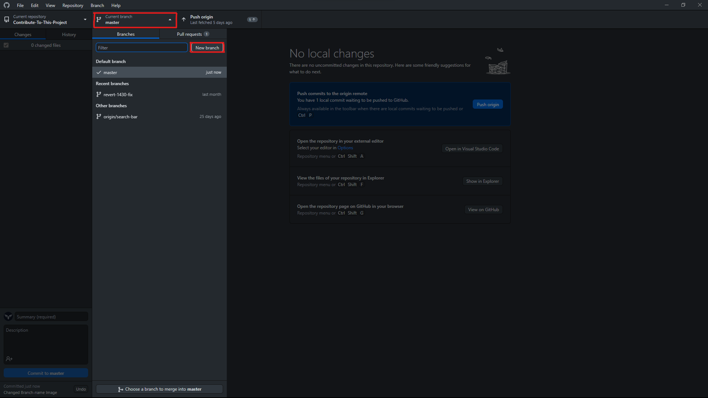
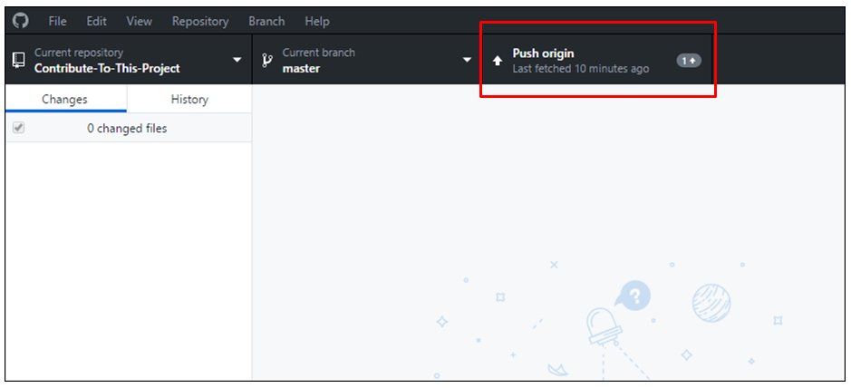

# [Contribute To This Project](https://syknapse.github.io/Contribute-To-This-Project/)

> ## **ঘোষণা:**
>
> আপনি কি আমাদের প্রকল্পে যুক্ত হয়ে আমাদের প্রকল্পটি পরিচালনা করতে এবং এটি বহাল রাখতে ইচ্ছুক?, তবে আমাদের [পরিচালনা নির্দেশাবলি](../maintainer_guide/maintainer_guide_bangla.md) পরুন এবং আমাকে [টুইটারে](https://twitter.com/Syknapse) একটি বার্তা প্রেরণ করুন।

## সূচনা

এটি গিটহাবে নতুনদের সহজ প্রকল্পে অংশগ্রহণ করতে সহায়তা করার জন্য একটি পথ প্রদর্শক।

## উদ্দেশ্য

- একটি ওপেন সোর্স প্রজেক্টে অবদান রাখা।
- গিটহাব ব্যাবহারকে আরও সহজ করে তোলা।

## এটি কার জন্য?

- এটি একদম নতুনদের জন্য। আপনি যদি একটি অ্যাঙ্কর ট্যাগ `` লিখতে এবং সম্পাদনা করতে জানেন, তবে আপনি এখানে অবদান রাখতে সক্ষম।
- অভিজ্ঞরাও এখানে অবদান রাখতে পারেন কিন্তু যারা তাদের প্রথম ওপেন সোর্স এ অবদান রাখতে চান এবং নিজের অভিজ্ঞতা ও আত্মবিশ্বাস বারাতে চান এই প্রকল্পটি তাদের জন্যও।

## আমাকে এটি কেন করতে হবে?

যেকোনো ওয়েব ডেভেলপার কে গিট সম্পর্কে দক্ষতা অর্জন করতে হবে, এবং গিটহাব হল সবার দ্বারা ব্যবহৃত সবচেয়ে জনপ্রিয় গিট হোস্টিং পরিষেবা। এটি ওপেন সোর্স প্লাটফর্মের শিকড়। গিটহাব ব্যবেহার করতে জানা একটি অপরিহার্য দক্ষতা। তাছাড়াও গিটহাবে একটি প্রকল্পে অবদান রাখলে তা আত্মবিশ্বাস বাড়াতে সহায়তা করে থাকে।

আপনি যদি একজন নতুন ডেভেলপার হন এবং আপনি যদি ভেবে থাকেন যে আপনার গিট এবং গিটহাব শিখতে হবে তবে এখানে উত্তরটি রয়েছেঃ [আপনার গতকাল গিট শেখা উচিত ছিল](https://codeburst.io/number-one-piece-of-advice-for-new-developers-ddd08abc8bfa 'নতুন ডেভেলপার? আপনার গতকাল গিট শেখা উচিত ছিল। Brandon Morelli, CodeBurst.io-এর প্রতিষ্ঠাতা').

## আমি এখানে কি করতে যাচ্ছি?

আপনি এই ছবির মত করে [আমাদের প্রকল্পের ওয়েবসাইটে](https://syknapse.github.io/Contribute-To-This-Project/ 'https://syknapse.github.io/Contribute-To-This-Project')আপনার সম্পর্কিত একটি কার্ড যোগ করতে চলেছেন। এতে আপনার নাম, আপনার টুইটার প্রোফাইল, একটি সংক্ষিপ্ত বিবরণ এবং আপনি সুপারিশ করা ওয়েব ডেভেলপারদের জন্য দরকারী সংস্থানগুলির ৩টি লিঙ্ক অন্তর্ভুক্ত করবেন।

আপনি HTML ফাইলের ভিতরে কার্ড টেমপ্লেটের একটি অনুলিপি তৈরি করবেন এবং আপনার নিজস্ব তথ্য দিয়ে এটি সাজাবেন।

> ### [আপনি যদি টার্মিনালের সাথে স্বাচ্ছন্দ্যবোধ করেন তবে এই টিউটোরিয়ালটিতে যান](/terminal-tutorial.md)

## অনুবাদ

এই টিউটোরিয়ালটি [অন্যান্য ভাষায়ও](translations/translation.md) পাওয়া যাবে।

| [আরবি](ARABIC.md)         | [ফরাসি](FRENCH.md)       | [জার্মান](German.md)   | [ইতালিয়ান](ITALIAN.md) | [কোরিয়ান](KOREAN.md)     | [পোলিশ](POLISH.md) |
| ------------------------- | ------------------------ | ---------------------- | ----------------------- | ------------------------- | ------------------ |
| [পর্তুগীজ](PORTUGUESE.md) | [সার্বিয়ান](SERBIAN.md) | [স্পেনীয়](SPANISH.md) | [তুর্কি](TURKISH.md)    | [ইংরেজি](../../README.md) | বাংলা              |

> Translations for either this README or the maintainer README file are very welcome!.

## সুচিপত্র

| <ul><li>[সূচনা](#সূচনা)</li><li>[আমি এখানে কি করতে যাচ্ছি?](#আমি-এখানে-কি-করতে-যাচ্ছি)</li><li>[প্রস্তুতি](#প্রস্তুতি-)</li><li>[অবদান রাখুন &rightarrow;](#অবদান-রাখুন)</li><li>[পরবর্তি ধাপসমুহ](#পরবর্তি-ধাপসমুহ)</li><li>[স্বীকৃতি](#স্বীকৃতি)</li></ul> | অবদান রাখুন: <ul><li>[ধাপ ১ঃ এই রিপোসিটরিটি আপনার প্রোফাইলে কপি করুন।](#ধাপ-১-এই-রিপোসিটরিটি-আপনার-প্রোফাইলে-কপি-করুন)</li><li>[ধাপ ২ঃ রিপোসিটরিটি ক্লোন করুন।](#ধাপ-২-রিপোসিটরিটি-ক্লোন-করুন)</li><li>[ধাপ ৩ঃ একটি নতুন শাখা তৈরি করুন।](#ধাপ-৩-একটি-নতুন-শাখা-তৈরি-করুন)</li><li>[ধাপ ৪ঃ index.html ফাইলটি খুলুন।](#ধাপ-৪-indexhtml-ফাইলটি-খুলুন)</li><li>[ধাপ ৫ঃ কার্ড এর টেম্পলেটটি কপি করুন।](#ধাপ-৫-কার্ড-এর-টেম্পলেটটি-কপি-করুন)</li><li>[ধাপ ৬ঃ প্রয়োজনীয় পরিবর্তন করুন।](#ধাপ-৬-প্রয়োজনীয়-পরিবর্তন-করুন)</li><li>[ধাপ ৭ঃ আপনার পরিবর্তনগুলি কমিট করুন।](#ধাপ-৭-আপনার-পরিবর্তনগুলি-কমিট-করুন)</li><li>[ধাপ ৮ঃ পরিবর্তনগুলো গিটহাবে পুশ করুন।](#ধাপ-৮-পরিবর্তনগুলো-গিটহাবে-পুশ-করুন)</li><li>[ধাপ ৯ঃ পুল রিকোয়েস্ট সাবমিট করুন।](#ধাপ-৯-পুল-রিকোয়েস্ট-সাবমিট-করুন)</li><li>[ধাপ ১০ঃ আনন্দ উদযাপন করুন।](#ধাপ-১০-আনন্দ-উদযাপন-করুন)</li></ul> |
| :----------------------------------------------------------------------------------------------------------------------------------------------------------------------------------------------------------------------------------------------------------- | :-------------------------------------------------------------------------------------------------------------------------------------------------------------------------------------------------------------------------------------------------------------------------------------------------------------------------------------------------------------------------------------------------------------------------------------------------------------------------------------------------------------------------------------------------------------------------------------------------------------------------------------------------------------------------------------------------------------------------------------------------------------------------------------------------------------------------------------------------- |

### প্রস্তুতি! :)

প্রথমে কাজটি করার জন্য প্রস্তুতি নেয়া যাক।

- আপনার GitHub অ্যাকাউন্টে লগইন করুন। যদি আপনার অ্যাকাউন্ট না থাকে তবে [অ্যাকাউন্ট খুলুন](https://github.com/join). পরবর্তি ধাপে যাওয়ার পুর্বে [GitHub হ্যালো ওয়ার্ল্ড টিউটোরিয়াল](https://guides.github.com/activities/hello-world/) সম্পন্ন করে নিন।
- [GitHub কম্পিউটার সফটওয়্যারটি](https://desktop.github.com/)নামিয়ে নিন।
  - বিকল্পভাবে আপনি যদি কমান্ড লাইনে গিট ব্যবহার করতে স্বাচ্ছন্দ্য বোধ করেন তবে আপনি তা করতে পারেন [এখানে CLI টিউটোরিয়ালের লিঙ্ক রয়েছে](../../terminal-tutorial.md)।
  - আপনি যদি [VS Code](https://code.visualstudio.com/ 'ভিজ্যুয়াল স্টুডিও কোড ওয়েবসাইট') ব্যাবহার করে থাকেন, এটি ইন্টিগ্রেটেড গিটের সাথে আসে এবং আপনাকে সরাসরি সম্পাদক থেকে যা প্রয়োজন তা করতে দেয়।
  - তবে এই টিউটোরিয়ালটি অনুসরণ করার সবচেয়ে সহজ উপায় হল GitHub ডেস্কটপ ব্যবহার করা।

## Now that you are all setup let's get on with the business of contributing to the project.

## [↑ Go to top ↑](#quick-access-index)

## Contribute

Become an open source contributor in 10 easy steps.

_Estimated time: Less than 30 minutes_.

<h5 align="center">Step 1: Fork this repository</h5>

- The objective here is to make a copy of this project and place it in your account.
- A repository (repo) is how a project is called on GitHub and a fork is a copy of it.
- Make sure you are on the [main page](https://github.com/Syknapse/Contribute-To-This-Project 'https://github.com/Syknapse/Contribute-To-This-Project') of this repo.

| <ul><li>Click on the _Fork_ button</li></ul> |  |
| :------------------------------------------- | ----------------------------------------------------: |

- You now have a complete copy of the project in your own account.
  [↑ Go to top ↑](#quick-access-index)

---

<h5 align="center">Step 2: Clone the repository</h5>

- Now we want to make a local copy of the project. That is a copy saved on your own machine.
- Open the GitHub desktop app. In the app:

| <ul><li>Click on _File_ then _Clone repository_</li></ul> |  |
| :-------------------------------------------------------- | -------------------------------------------------------------: |

| <ul><li>You will see a list of your projects and forks on GitHub.</li><li>Select `<your-github-username>/Contribute-To-This-Project`.</li><li>Click _Clone_</li></ul> |  |
| :-------------------------------------------------------------------------------------------------------------------------------------------------------------------- | :----------------------------------------------------------------------------------------------------------------: |
| <ul><li>A forked project will have the fork symbol on the left.</li><li>Your fork will have your own GitHub user name.</li></ul>                                      |        |

- This will take a moment as the project is copied to your hard disk. I recommend that you keep the default path which is usually `..\Documents\GitHub`.
- Now you have a local copy of the project.

---

<h5 align="center">Step 3: Create a new branch</h5>

- Once the repo has been cloned and you have it open in GitHub desktop it is time to create a new branch.
- A branch is a way to keep your changes separate from the main part of the project called `Master`. For example if things go wrong and you are not happy with your changes you can simply delete the branch and the main project won't be affected.

| <ul><li>Click on _Current branch_</li><li>Then click on _New_</li></ul> |  |
| :---------------------------------------------------------------------- | ---------------------------------------------------------------------------------: |

| <ul><li>Give your branch a name</li><li>Click `Create branch`</li></ul> |  |
| :---------------------------------------------------------------------- | -------------------------------------------------------------------: |

- You can name it whatever you want, but since this is a branch to add a card with your name to the project, calling it `your-name-card` is good practice because it keeps the intention of this branch clear.

| <ul><li>Publish your new branch to GitHub</li></ul> |  |
| :-------------------------------------------------- | ------------------------------------------------------------------------------------------------------------------------: |

- Now you have created a new branch separate from the master.
- For the next steps make sure you are working in this branch. You will see the name of the branch you are on at the top center of the GitHub desktop app where it says _Current branch_.

**Do NOT work on the `master` branch**

---

<h5 align="center">Step 4: Open the index.html file</h5>

- Now we need to open the file we are going to edit with your favourite code editor.
- Find the project folder on your computer. If you have kept the default this should be something like `your-computer > Documents > GitHub > Contribute-To-This-Project`
- The `index.html` file is directly in the `Contribute-To-This-Project` folder.

| <ul><li>Open your code editor (Sublime, VS Code, Atom..etc) and use the `Open file` command and locate the index.html file in the main directory of the project</li><li>Alternatively you can locate the file on your hard drive, right click, and open with your editor</li></ul> |  |
| :--------------------------------------------------------------------------------------------------------------------------------------------------------------------------------------------------------------------------------------------------------------------------------- | -----------------------------------------------------------------------------------------: |

- Now you have the file you are going to edit open in your editor and you are ready to start making changes to it.

---

<h5 align="center">Step 5: Copy the card template</h5>

- We will make a copy of the card template to start working on it

| <ul><li>At the top of the html file, under the `<head>` and `<header>` sections you will find the section labelled `== TEMPLATE ==`</li><li>Copy everything within the red square in the image, from the `Contributor card START` comment to the `Contributor card END` comment</li></ul> |
| :---------------------------------------------------------------------------------------------------------------------------------------------------------------------------------------------------------------------------------------------------------------------------------------- |
|                                                                                                                                                                                                            |

| <ul><li>Paste the whole thing directly below the comment indicating it</li><li>Make sure there is a single line of space between your card start and the last card end. It's good practice to keep our code as clear as possible</li><li>Never use a linters or style formatters. The project has Prettier setup</li></ul> |
| :------------------------------------------------------------------------------------------------------------------------------------------------------------------------------------------------------------------------------------------------------------------------------------------------------------------------- |
|                                                                                                                                                                                                                                   |

- This now is **your** card for you to customise and edit.

---

<h5 align="center">Step 6: Apply your changes</h5>

- We'll now start editing html, changing the customizable fields in our card.

| <ul><li>Replace 'Name' with your name</li><li>Note: Don't change `class="name"`</li></ul> |  |
| :---------------------------------------------------------------------------------------- | -----------------------------------------------------------------: |

| <ul><li>Insert the URL of your Twitter account `href="Insert URL here"`</li><li>Type your handle in the text field</li></ul> |
| :--------------------------------------------------------------------------------------------------------------------------- |
|          |

- If you prefer to use a contact other than Twitter you will need to replace the twitter icon `<i class="fa fa-twitter"></i>` by going to [Font Awesome Icons](http://fontawesome.io/icons/) searching for the right icon and replacing only the `fa-twitter` part with the new icon like `fa-facebook` for example. Then follow the same steps above.

| <ul><li>Tell us something about you</li><li>Keep it short and sweet. Think about it more like a tweet than a blog post</li></ul> |  |
| :------------------------------------------------------------------------------------------------------------------------------- | -------------------------------------------------------------------------------: |

| <ul><li>Share with the community 3 links to resources that are useful for web development</li><li>This can be anything, a video, a talk, a podcast, an article, a reference, or a tool</li><li>If you are a beginner don't be intimidated by this, share whatever you know even if you think it's basic. You'll be surprised how many people will benefit</li></ul> |
| :------------------------------------------------------------------------------------------------------------------------------------------------------------------------------------------------------------------------------------------------------------------------------------------------------------------------------------------------------------------ |
|                                                                                                                                                                                                                              |
| <ul><li>Link: Insert the link `href="here"` replacing the `#`</li><li>Title: Write a brief description `title="here"`</li><li>Name: Write the resource's name in the text field `>here</a>`</li></ul>                                                                                                                                                               |

- Make sure you have **saved all your changes**.
- **Test your changes**. THIS IS IMPORTANT! Open the html file in your browser (by double clicking on it for example) and see what your card will look like on the site. See that the entire page still looks the same and nothing is broken. Click your links and make sure they are working. Open the console (Ctrl + Shift + J (Windows / Linux) or Cmd + Opt + J (Mac)) and check that there are no error messages.
- Great, you have finished editing your code! The next steps will send your changes to GitHub and then submit them to be merged with the main project.

---

<h5 align="center">Step 7: Commit your changes</h5>

- Go back to the GitHub desktop app.
- Your changes will have been added automatically to the staging area.
- This means that Git has recorded all the **saved** changes.
- You can see this reflected in the app. Everything you have added to the file will be in green, and deletions will show as red.

| <ul><li>The next step is called _Commit_</li><li>This roughly means "confirm the changes"</li></ul> |  |
| :-------------------------------------------------------------------------------------------------- | ---------------------------------------------------------------------------------------------------------------------------------------------------------------------------------: |

| <ul><li>This is what your GitHub desktop header should look like</li><li>Notice the fork symbol next to the project name in `Current repository`</li><li>Your `Current branch` will have the name you gave it in step 3</li></ul> |
| :-------------------------------------------------------------------------------------------------------------------------------------------------------------------------------------------------------------------------------- |
|                                          |

| <ul><li>To _Commit_ you must fill in the _Summary_ field</li><li>This is the commit message explaining what you have changed</li><li>In this case "Add my card information" would be a reasonable message</li><li>Optionally you can add a more detailed _Description_</li><li>Click the _Commit_ button. Your button will say something like `Commit to "your-branch-name"`</li></ul> |  |
| :------------------------------------------------------------------------------------------------------------------------------------------------------------------------------------------------------------------------------------------------------------------------------------------------------------------------------------------------------------------------------------- | -------------------------------------------------------------------------------------------------------------------------------------------------: |

---

<h5 align="center">Step 8: Push your changes to GitHub</h5>

- Your changes are now saved or committed. But they are saved only locally, that is on your computer.
- Synchronizing local changes with your repository on GitHub is called a _Push_. You are "pushing" the changes from your local repository to the remote repository on GitHub.

| <ul><li>Click the _Push_ button</li></ul> |  |
| :---------------------------------------- | ------------------------------------------------------------------------------------------------------: |

- After a few seconds the operation is complete and now you have exactly the same copy of this branch on your machine as well as on GitHub.

---

<h5 align="center">Step 9: Submit a PR(Pull Request)</h5>

- This is the moment you have been waiting for; submitting a _Pull Request_ (PR).
- So far all the work you have done has been on the fork of the project, which as you remember resides on your own account of GitHub.
- Now it's time to send your changes to the main project to be merged with it.
- This is called a [_Pull Request_](https://help.github.com/articles/about-pull-requests/ 'About Pull Requests - GitHub Help') because you are asking the original project maintainer to "pull" your changes into their project.
- Go to the main page of **your fork** on GitHub (it will have the fork icon and your own user name at the top).
- Towards the top of the repo you will see a highlighted pull request message with a green button.

| <ul><li>Click on the `Compare and pull request`</li></ul> |  |
| :-------------------------------------------------------- | ------------------------------------------------------------------------------------------------------------------------------------------------------------------------: |

| <ul><li>This is what the `Open a pull request` page looks like.</li><li>REMEMBER _you are trying to merge your branch with the original project not with the `Master` branch on your fork_.</li><li>The image below gives you an idea of how the header of your pull request should look like.</li><li>On the left is the original project, followed by the master branch. On the right is your fork and the branch you created.</li></ul> |
| :----------------------------------------------------------------------------------------------------------------------------------------------------------------------------------------------------------------------------------------------------------------------------------------------------------------------------------------------------------------------------------------------------------------------------------------- |
|                                                                                                                                                                                                                                                                 |

| <ul><li>Create a pull request:</li><li>Write a title</li><li>Add optional information in the description</li><li>Click `Create pull request`</li></ul> |  |
| :----------------------------------------------------------------------------------------------------------------------------------------------------- | -----------------------------------------------------------------------------------------------------------: |

- Don't be fazed by all the options. You only need to do these three steps for now.
- Leave the option `Allow edits from maintainers` ticked.
- Now, a _Pull Request_ will be sent to the project maintainer. As soon as it is reviewed and accepted your changes will appear on the [project web page](https://syknapse.github.io/Contribute-To-This-Project 'Contribute To This Project web page').

---

<h5 align="center">Step 10: Celebrate!!</h5>

That's it. You have done it! You have now contributed to open source on GitHub.

You have added code to a live web page: [https://syknapse.github.io/Contribute-To-This-Project](https://syknapse.github.io/Contribute-To-This-Project)

Your changes **won't be visible immediately**; first they have to be reviewed, accepted, and merged by the project maintainer. Once they are merged your card should be visible and live on the page.

It is very normal for a reviewer to ask for changes on a PR. Think of it as good practice if it happens to you. Keep an eye for comments and requested changes. Once you make the requested changes (back in your branch) all you have to do is to commit and push your changes. The PR will automatically update with the new changes.

I promise I will try to review and merge as soon as possible but I do this in my spare time, so a few days delay is inevitable.

---

---

<h4 align="center">Next Steps</h4>

- Come back in a while to check for your merged Pull Request.
- You should receive an email from GitHub when your changes have been approved, or if additional changes are requested. And when the PR is finally merged with the master and your card has been added.
- If you found this project **useful** please give it a :star: star :star: at the top of the page and **Tweet** about it to help spread the word 
- You can **follow me** and get in touch on [Twitter](https://twitter.com/Syknapse '@Syknapse') or [using any of these other options](https://syknapse.github.io/Syk-Houdeib/#contact 'My contact section | Portfolio')
- This is an open source project so apart from contributing your card you are welcome to help fix bugs, improvements, or new features. Open an [issue](https://help.github.com/articles/creating-an-issue/ 'Mastering Issues | GitHub Guides') or send a new [pull request](https://help.github.com/articles/creating-a-pull-request-from-a-fork/ 'Creating a pull request from a fork | GitHub Help')
- To help improve our community take a look at the GitHub [Discussions](https://github.com/Syknapse/Contribute-To-This-Project/discussions) tab located next to Pull Requests. This area is a place to introduce yourself, go into deeper discussions on Open Source, and communicate with the Project Maintainers. Will you help us build out this feature and enhance our community?
- **Thanks for contributing to this project**. Now you can go ahead and try contributing to other projects; look for the  label for beginner-friendly contribution options.
- I'm also looking for collaborators to give me a hand in reviewing and merging PRs. If you would like to get more advanced Git practice please send me a DM on Twitter and read the [maintainer's guide](maintainer_guide.md).

<h4 align="center">Acknowledgements</h4>

This project is heavily influenced by [Roshan Jossey's](https://github.com/Roshanjossey) great [first-contributions](https://github.com/Roshanjossey/first-contributions) project with its excellent tutorial.

It is also particularly inspired by the great community around [#GoogleUdacityScholars](https://twitter.com/hashtag/GoogleUdacityScholars?src=hash) The Google Challenge Scholarship: Front-End Web Dev, class of 2017 Europe.

<h4 align="center">Project Info</h4>

<h4 align="center">PR info:</h4>

<h4 align="center">Maintainers</h4>

[Back to the top &uparrow;](#সূচনা)
