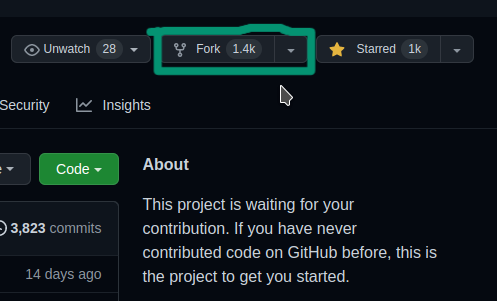
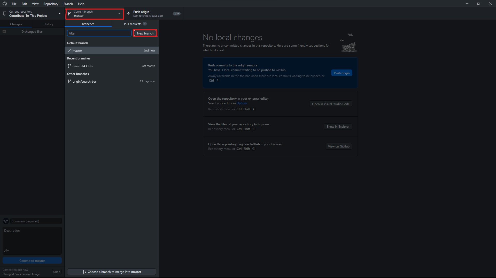
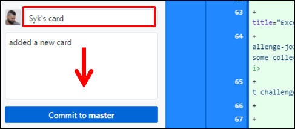
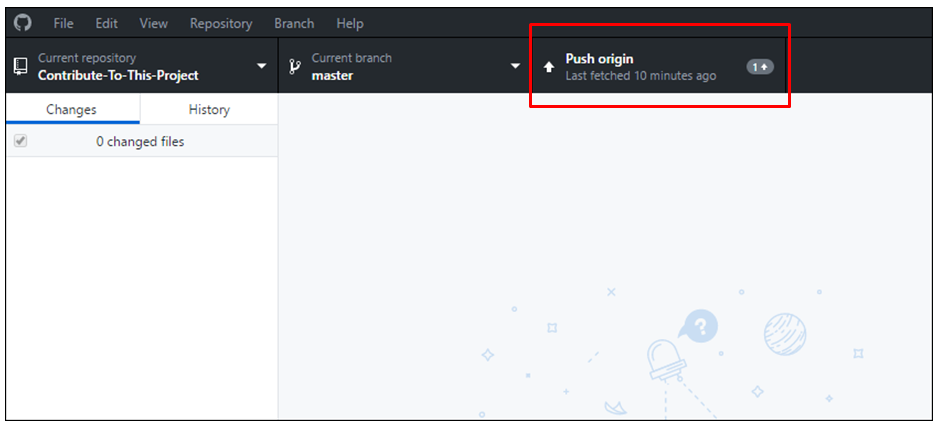

> ⚠️ **This translation is outdated.** It describes an old workflow that no longer works. Please follow the [English README](../../README.md) for the current step-by-step tutorial.

---

> **Note:** The contribution tutorial has been updated. Please follow the [main README](https://github.com/Syknapse/Contribute-To-This-Project#readme) for the current instructions — it is the authoritative guide regardless of language.

---

# [Bidra til dette prosjektet](https://syknapse.github.io/Contribute-To-This-Project/)

> Logo Created with :sparkling_heart: By [CandidDeer](https://github.com/CandidDeer)

[][twit]

---

> ## **Kunngjøring:**
>
> Vil du bli vedlikeholder for dette prosjektet og hjelpe til med å holde det i gang? Hvis du er interessert, les [vedlikeholderens guide](/maintainer_guide.md) og send meg en DM på [Twitter](https://twitter.com/Syknapse).

---

### Hurtigtilgang indeks

#### Oversikt

- [Kunngjøringer](#kunngjøring)
- [Introduksjon](#introduksjon)
- [Hvem er dette for?](#hvem-er-dette-for)
- [Hvorfor må jeg gjøre dette?](#hvorfor-må-jeg-gjøre-dette)
- [Hva skal jeg bidra til?](#hva-skal-jeg-bidra-med)
- [Oversettelser](#oversettelse)
- [Oppsett](#oppsett-)
- [Neste steg](#neste-steg)
- [Anerkjennelse](#anerkjennelse)

#### Steg

- [Bidra](#bidra)
- [Steg 1 - Forke](#steg-1-fork-dette-repositoriet)
- [Steg 2 - Klone](#steg-2-klon-repositoriet)
- [Steg 3 - Opprette en ny gren](#steg-3-opprett-en-ny-gren)
- [Steg 4 - Åpne hoved HTML-filen](#steg-4-åpne-indexhtml-filen)
- [Steg 5 - Kopiere malen for kort](#steg-5-kopier-kortmalen)
- [Steg 6 - Gjøre dine endringer](#steg-6-gjør-dine-endringer)
- [Steg 7 - Commit](#steg-7-utfør-endringene-dine)
- [Steg 8 - Pushe til GitHub](#steg-8-push-dine-endringer-til-github)
- [Steg 9 - Sende inn en PR](#steg-9-send-en-prpull-request)
- [Steg 10 - Feire](#steg-10-feire)

---

## Introduksjon

Dette er en veiledning for å hjelpe førstegangs bidragsytere med å delta i et enkelt og lett prosjekt.

### Mål

- Gi et bidrag til et åpen kildekode-prosjekt.
- Bli mer komfortabel med å bruke GitHub.

### Hvem er dette for?

- Dette er for absolutte nybegynnere. Hvis du vet hvordan du skal skrive og redigere et anker tag ``, så burde du kunne gjøre det.
- Det er også for de som har litt mer erfaring, men som ønsker å gjøre sitt første bidrag til åpen kildekode, eller få flere bidrag for mer erfaring og selvtillit.

### Hvorfor må jeg gjøre dette?

Enhver webutvikler, enten aspirerende eller erfaren, trenger å bruke Git-versjonskontroll, og GitHub er den mest populære Git-vertstjenesten som brukes av alle. Det er også hjertet av fellesskapet for åpen kildekode. Å bli komfortabel med å bruke GitHub er en essensiell ferdighet. Å bidra til et prosjekt øker selvtilliten din og gir deg noe å vise frem på din GitHub-profil.

Hvis du er en ny utvikler og du lurer på om du trenger å lære deg Git og GitHub, så er her svaret: [Du burde ha lært deg Git i går](https://codeburst.io/number-one-piece-of-advice-for-new-developers-ddd08abc8bfa 'Ny utvikler? Du burde ha lært deg Git i går. Av Brandon Morelli, skaperen av CodeBurst.io').

### Hva skal jeg bidra med?

Du skal bidra med et kort som ligner på dette til [prosjektets nettside](https://syknapse.github.io/Contribute-To-This-Project/ 'https://syknapse.github.io/Contribute-To-This-Project'). Det vil inneholde navnet ditt, din Twitter-håndtak, en kort beskrivelse, og 3 lenker til nyttige ressurser for webutviklere som du anbefaler.

Du vil lage en kopi av kort malen inne i HTML-filen og tilpasse den med din egen informasjon.

---

### Oversettelse

Denne veiledningen er også tilgjengelig på [andre språk](/translations/README.md)

| [Arabisk](/translations/README/ARABIC.md)  |     [Bengali](/translations/README/BANGLA.md)     | [Kinesisk (Tradisjonell)](/translations/README/CHINESE_TRADITIONAL.md) |            [Engelsk](/README.md)            |  [Fransk](/translations/README/FRENCH.md)  |
| :----------------------------------------: | :-----------------------------------------------: | :--------------------------------------------------------------------: | :-----------------------------------------: | :----------------------------------------: |
|   [Tysk](/translations/README/GERMAN.md)   |      [Hindi](/translations/README/HINDI.md)       |              [Italiensk](/translations/README/ITALIAN.md)              | [Japansk](/translations/README/JAPANESE.md) | [Koreansk](/translations/README/KOREAN.md) |
|  [Polsk](/translations/README/POLISH.md)   | [Portugisisk](/translations/README/PORTUGUESE.md) |               [Russisk](/translations/README/RUSSIAN.md)               | [Serbisk](/translations/README/SERBIAN.md)  | [Spansk](/translations/README/SPANISH.md)  |
| [Tyrkisk](/translations/README/TURKISH.md) |   [Ukrainsk](/translations/README/UKRAINIAN.md)   |               [Norsk](/translations/README/NORWEGIAN.md)               |

> Oversettelser for prosjektdokumentasjon er velkommen. Les [`Oversettelses guide`](/translations/README.md) for å bidra.

---

### Oppsett! :)

Merk: Denne veiledningen er basert på Github for PC. [Hvis du er komfortabel med terminalen, gå til denne veiledningen (Klikk her)](/terminal_tutorial.md)

Først la oss gjøre klar for å sette i gang med arbeidet

1. Logg inn på din GitHub-konto. Hvis du ikke allerede har en konto, så [bli med i Github](https://github.com/join). Jeg anbefaler at du gjennomfører [GitHub Hello World-veiledningen](https://guides.github.com/activities/hello-world/) før du forsetter.
2. Last ned [GitHub Desktop app](https://desktop.github.com/).
   - Alternativt, hvis du er komfortabel med å bruke Git i kommandolinjen, kan du gjøre det [Her er lenken til CLI-veiledningen](/terminal-tutorial.md).
   - Hvis du bruker [VS Code](https://code.visualstudio.com/ 'Visual Studio Code website') så kommer den med integrert Git og lar deg gjøre det vi trenger direkte fra editoren.
   - Likevel er den enkleste og letteste måten å følge denne veiledningen på er ved å bruke GitHub Desktop.

> Nå som alt er klart, la oss fortsette med arbeidet med å bidra til prosjektet.

[↑ Gå til toppen ↑](#hurtigtilgang-indeks)

---

### Bidra

Bli en bidragsyter til åpen kildekode i 10 enkle steg.

_Anslått tid: Mindre enn 30 minutter_.

#### Steg 1: Fork dette repositoriet

- Målet her er å lage en kopi av dette prosjektet og plassere det på din konto.
- Et repositorium (repo) er et prosjekt på GitHub, og en fork er altså en kopi av det.
- Sørg for at du er på [hovedsiden](https://github.com/Syknapse/Contribute-To-This-Project 'https://github.com/Syknapse/Contribute-To-This-Project') av dette repositoriet.

|  |
| :---------------------------------------------------: |
|              **Klikk på _Fork_ knappen**              |

- Du har nå en komplett kopi av prosjektet på din egen konto.

[↑ Gå til toppen ↑](#hurtigtilgang-indeks)

---

#### Steg 2: Klon repositoriet

- Nå vil vi lage en lokal kopi av prosjektet. Det vil si en kopi lagret på din egen maskin.
- Åpne GitHub Desktop-appen. I appen:

|  |
| :-------------------------------------------------------------------: |
|          **Klikk på _File_ og deretter _Clone repository_**           |

- Du vil se en liste over prosjektene dine og forks på GitHub.
- Velg `<ditt-github-brukernavn>/Contribute-To-This-Project`.
- Trykk på _Clone_

|  |
| :------------------------------------------------------------------------------------------------------------------: |

| :arrow_right_hook: Et forket prosjekt vil ha forksymbolet på venstre side. Din fork vil ha ditt eget GitHub bruker |  |
| :----------------------------------------------------------------------------------------------------------------- | :-----------------------------------------------------------------------------------------------------: |

- Dette vil ta et øyeblikk ettersom prosjektet kopieres til harddisken din. Jeg anbefaler at du beholder standard banen som vanligvis er `..\Documents\GitHub`.
- Nå har du en lokal kopi av prosjektet.

[↑ Gå til toppen ↑](#hurtigtilgang-indeks)

---

#### Steg 3: Opprett en ny gren

- Når repositoriet er klonet og du har det åpent i GitHub Desktop, er det på tide å opprette en ny gren.
- En gren er en måte å holde endringene dine atskilt fra hoveddelen av prosjektet, som kalles for `Master`. For eksempel, hvis ting ikke går som planlagt og du ikke er fornøyd med endringene dine, kan du ganske enkelt slette grenen, og hovedprosjektet vil ikke bli påvirket.

| :arrow*right_hook: klikk på *`Current branch`_, Deretter klikker du på _`New`\_      |                                                      |
| :----------------------------------------------------------------------------------- | :-------------------------------------------------------------------------------------------------------------------------------------: |
| :arrow_right_hook: **Gi grenen din et navn, deretter klikker du på `Create branch`** |                                                                      |
| :arrow_right_hook: **Publiser din nye gren til GitHub**                              |  |

- Du kan navngi den hva du vil, men siden dette er en gren for å legge til et kort med navnet ditt i prosjektet, er det å kalle den `ditt-navn-kort` god praksis fordi det holder hensikten med denne grenen klar.
- Nå har du opprettet en ny gren atskilt fra master.
- For de neste stegene, sørg for at du jobber i denne grenen. Du vil se navnet på grenen du er på øverst i midten av GitHub Desktop-appen der det står _Current branch_.

**Jobb IKKE på `master` grenen**

[↑ Gå til toppen ↑](#hurtigtilgang-indeks)

---

#### Steg 4: Åpne index.html filen

- Nå må vi åpne filen vi skal redigere med din favoritt kodeeditor.
- Finn prosjektmappe på datamaskinen din. Hvis du har beholdt standarden, bør dette være noe som `din-datamaskin > Dokumenter > GitHub > Contribute-To-This-Project`
- `index.html` filen ligger direkte i `Contribute-To-This-Project` mappen.
- Åpne din kodeeditor (Sublime, VS Code, Atom osv.), bruk kommandoen `Åpne fil` og finn index.html-filen i hovedkatalogen til prosjektet.

|                    |
| :---------------------------------------------------------------------------------------------------------: |
| :arrow_right_hook: **Alternativt kan du finne filen på harddisken din, høyreklikke og åpne med din editor** |

- Nå har du filen du skal redigere åpen i din editor, og du er klar til å begynne å gjøre endringer på den.

[↑ Gå til toppen ↑](#hurtigtilgang-indeks)

---

#### Steg 5: Kopier kortmalen

- Vi vil lage en kopi av kortmalen for å begynne å arbeide med den.
- Øverst i html-filen, under `<head>` og `<header>` seksjonene, vil du finne seksjonen merket `== TEMPLATE ==`
- Kopier alt innenfor den røde firkanten i bildet, fra kommentaren `Contributor card START` til kommentaren `Contributor card END`

|  |
| :---------------------------------------------------------------------: |

- Lim inn hele innholdet rett under kommentaren som angir det
- Sørg for at det er en enkelt linje med mellomrom mellom starten av ditt kort og slutten av det forrige kortet. Det er god praksis å holde koden vår så tydelig som mulig
- Ikke bruk lintere eller stilformaterere. Prosjektet har Prettier satt opp

|  |
| :---------------------------------------------------------------------------------------: |

- Dette er nå **din** kort som du kan tilpasse og redigere.

[↑ Gå til toppen ↑](#hurtigtilgang-indeks)

---

#### Steg 6: Gjør dine endringer

- Vi vil nå begynne å redigere HTML, endre de tilpassbare feltene på vårt kort.

| :arrow_right_hook: Erstatt 'Name' med ditt navn |  |
| :---------------------------------------------- | :---------------------------------------------------------------------: |

- **Merk: Ikke endre `class="name"`**

| :arrow_right_hook: Sett inn URL-en til din Twitter-konto `href="Sett inn URL her"`, Skriv inn ditt brukernavn i tekstfeltet |  |
| :-------------------------------------------------------------------------------------------------------------------------- | :---------------------------------------------------------------------------------------------------------------------------: |

- Hvis du foretrekker å bruke en annen kontakt enn Twitter, må du erstatte Twitter-ikonet `<i class="fa fa-x-twitter"></i>` ved å gå til [Font Awesome Icons](http://fontawesome.io/icons/), søke etter det riktige ikonet og bare erstatte `fa-x-twitter` delen med det nye ikonet som `fa-facebook` for eksempel. Deretter følger du de samme stegene ovenfor.

|                                                                                                                                                                                                                                                                                                             |
| :---------------------------------------------------------------------------------------------------------------------------------------------------------------------------------------------------------------------------------------------------------------------------------------------------------------------------------------------------------------------------------------: |
|                                                                                                                             :arrow_right_hook: **Fortell oss noe om deg selv. Hold det kort og godt. Tenk på det mer som en tweet enn et blogginnlegg post**                                                                                                                              |
|                                                                                                                                                                                                                                                       |
| :arrow_right_hook: **Del med fellesskapet 3 lenker til ressurser som er nyttige for webutvikling. Dette kan være hva som helst, en video, et foredrag, en podcast, en artikkel, en referanse eller et verktøy. Hvis du er nybegynner, ikke la deg skremme av dette, del hva du vet selv om du tror det er grunnleggende. Du vil bli overrasket over hvor mange som vil ha nytte av det.** |

- **Lenke:** Sett inn lenken `href="her"` ved å erstatte `#`. Vennligst unngå å bruke URL-forkortere eller URL-er som ikke er fra nettstedet du legger ut fra!
- **Tittel:** Skriv en kort beskrivelse `title="her"`.
- **Navn:** Skriv navnet på ressursen i tekstfeltet `>her</a>`.
- Sørg for at du har **lagret alle endringene dine**.
- **Test endringene dine**. DETTE ER VIKTIG! Åpne html-filen i nettleseren din (for eksempel ved å dobbeltklikke på den) og se hvordan kortet ditt vil se ut på nettstedet. Kontroller at hele siden fremdeles ser lik ut og at ingenting er ødelagt. Klikk på lenkene dine og forsikre deg om at de fungerer. Åpne konsollen (Ctrl + Shift + J (Windows/Linux) eller Cmd + Opt + J (Mac)) og sjekk at det ikke er noen feilmeldinger.
- Flott, du har fullført redigeringen av koden din! De neste stegene vil sende endringene dine til GitHub og deretter sende dem inn for å bli merged sammen med hovedprosjektet.

[↑ Gå til toppen ↑](#hurtigtilgang-indeks)

---

#### Steg 7: Utfør endringene dine

- Gå tilbake til GitHub-Desktop appen.
- Endringene dine vil ha blitt lagt til automatisk i staging området.
- Dette betyr at Git har registrert alle de **lagrede** endringene.
- Du kan se dette reflektert i appen. Alt du har lagt til i filen vil være i grønt, og slettinger vil vises som rødt.

|                                                                                                                                                                                |
| :---------------------------------------------------------------------------------------------------------------------------------------------------------------------------------------------------------------------------------------------------------------------------------------------------------------------------------------------------------------------------: |
|                                                                                                                                       :arrow*right_hook: Det neste steget kalles *`Commit`\_. Dette betyr omtrent `bekreft endringene`                                                                                                                                        |
|                                                                                                                                                                          |
|                                                                            :arrow_right_hook: **Dette er hvordan GitHub-Desktop appen ditt bør se ut. Legg merke til fork symbolet ved siden av prosjektnavnet under `Current repository`, Din `Current branch` vil ha navnet du ga den i steg 3**                                                                            |
|                                                                                                                                                                                                          |
| :arrow*right_hook: \*\*For å *`Committe`_ må du fylle ut _`Sammendrag`_ feltet. Dette er commit-meldingen som forklarer hva du har endret. I dette tilfellet ville `"Add my card information"` være en fornuftig melding. Eventuelt kan du legge til en mer detaljert _`Beskrivelse`_. Klikk på _`Commit`\_ knappen. Din knapp vil si noe som `Commit to "din-gren-navn"`\*\* |

[↑ Gå til toppen ↑](#hurtigtilgang-indeks)

---

#### Steg 8: Push dine endringer til GitHub

- Dine endringer er nå lagret eller bekreftet. Men de er bare lagret lokalt, det vil si på datamaskinen din.
- Synkronisering av lokale endringer med ditt repositorium på GitHub kalles en _Push_. Du "pusher" endringene fra ditt lokale repositorium til det eksterne repositoriet på GitHub.

| :arrow*right_hook: Klikk på *`Push`\_ knappen |  |
| :-------------------------------------------- | :-------------------------------------------------------------------------------------------------------: |

- Etter noen sekunder er operasjonen fullført, og nå har du nøyaktig den samme kopien av denne grenen på maskinen din som på GitHub.

[↑ Gå til toppen ↑](#hurtigtilgang-indeks)

---

#### Steg 9: Send en PR(Pull Request)

- Dette er øyeblikket du har ventet på; å sende inn en Pull Request (PR).
- Hittil har alt arbeidet du har gjort vært på en fork av prosjektet, som du husker ligger på din egen konto på GitHub.
- Nå er det på tide å sende endringene dine til hovedprosjektet for å bli merged sammen med det.
- Dette kalles en [_Pull Request_](https://help.github.com/articles/about-pull-requests/ 'Om Pull Requests - GitHub Help') fordi du ber vedlikeholderen av det opprinnelige prosjektet om å "trekke inn" endringene dine i deres prosjekt.
- Gå til hovedsiden for **din fork** på GitHub (den vil ha fork ikonet og ditt eget brukernavn øverst).
- Mot toppen av repoet vil du se en fremhevet melding for pull request med en grønn knapp.

|                   |
| :------------------------------------------------------------------------------------------------------------------------------------------------------------------------------: |
|                                                            :arrow_right_hook: **Klikk på `Compare and pull request`**                                                            |
|  |
|                                                   :arrow_right_hook: Dette er hvordan siden for `Åpne en pull request` ser ut.                                                   |

- HUSK _du prøver å merge sammen grenen din med det opprinnelige prosjektet, ikke med `Master` grenen på din fork_.
- Bildet nedenfor gir deg en ide om hvordan overskriften på din pull request skal se ut.
- På venstre side er det opprinnelige prosjektet, etterfulgt av master grenen. På høyre side er din fork og grenen du opprettet.

|                                  |
| :--------------------------------------------------------------------------------------------------------------------------------------------: |
| :arrow_right_hook: **Opprett en pull request: Skriv en tittel, legg til valgfri informasjon i beskrivelsen og klikk på `Create pull request`** |

- Ikke la deg skremme av alle alternativene. Du trenger bare å gjøre disse tre stegene for øyeblikket.
- La alternativet `Allow edits from maintainers` være haket av.
- Nå vil en _Pull Request_ bli sendt til prosjektets vedlikeholder. Så snart den blir gjennomgått og akseptert, vil endringene dine vises på [prosjekt nettstedet](https://syknapse.github.io/Contribute-To-This-Project 'Bidra til denne prosjekt nettstedet').

[↑ Gå til toppen ↑](#hurtigtilgang-indeks)

---

#### Steg 10: Feire

Det er det! Du har gjort det! Du har nå bidratt til åpen kildekode på GitHub.

Du har lagt til kode på en aktiv nettside: [https://syknapse.github.io/Contribute-To-This-Project](https://syknapse.github.io/Contribute-To-This-Project)

Endringene dine vil **ikke være synlige umiddelbart**; først må de gjennomgås, aksepteres og merged sammen av prosjektets vedlikeholder. Når de er merged sammen, skal kortet ditt være synlig og aktivt på siden.

Det er helt normalt at en anmelder ber om endringer på en PR. Tenk på det som god praksis hvis det skjer med deg. Vær oppmerksom på kommentarer og etterspurte endringer. Når du har gjort de etterspurte endringene (tilbake i din gren) er alt du trenger å gjøre er å comitte og pushe endringene dine. PR-en vil automatisk oppdateres med de nye endringene.

Jeg lover at jeg vil prøve å vurdere og merge så snart som mulig, men jeg gjør dette på fritiden min, så noen dagers forsinkelse er uunngåelig.

[↑ Gå til toppen ↑](#hurtigtilgang-indeks)

---

### Neste steg

- Kom tilbake om en stund for å sjekke din merged Pull Request.
- Du burde motta en e-post fra GitHub når endringene dine har blitt godkjent, eller hvis ytterligere endringer etterspørres. Og når PR-en til slutt er merged med masteren og kortet ditt har blitt lagt til.
- Du kan også lære hvordan du kan bidra fra denne _gratis_ serien: [Hvordan bidra til et åpen Kildekode-prosjekt på GitHub](https://kcd.im/pull-request)
- Hvis du fant dette prosjektet **nyttig** vennligst gi det en :star: stjerne :star: øverst på siden og **Tweet** om det for å hjelpe med å spre ordet! [][twit]
- Du kan **følge meg** og ta kontakt på [𝕏 (Twitter)](https://twitter.com/Syknapse '@Syknapse') eller [ved å bruke noen av disse andre alternativene](https://syknapse.github.io/Syk-Houdeib/#contact 'Kontakt | Portfolio')
- Dette er et åpen kildekode-prosjekt, så i tillegg til å bidra med ditt kort, er du velkommen til å hjelpe til med å rette feil, gjøre forbedringer eller legge til nye funksjoner. Åpne et [problem](https://help.github.com/articles/creating-an-issue/ 'Å mestre problemer | GitHub Guides') eller send en ny [pull request](https://help.github.com/articles/creating-a-pull-request-from-a-fork/ 'Å opprette en pull request fra en fork | GitHub Hjelp')
- For å hjelpe til med å forbedre vårt fellesskap, ta en titt på GitHub-fanen [Diskusjoner](https://github.com/Syknapse/Contribute-To-This-Project/discussions) som er plassert ved siden av Pull Requests. Dette området er et sted for å introdusere deg selv, gå dypere inn i diskusjoner om åpen kildekode, og kommunisere med prosjektvedlikeholderne. Vil du hjelpe oss med å bygge ut denne funksjonen og forbedre vårt fellesskap?
- **Takk for at du bidrar til dette prosjektet**. Nå kan du gå videre og prøve å bidra til andre prosjekter; se etter  etiketten for bidragsmuligheter som er vennlige for nybegynnere.
- Jeg ser også etter samarbeidspartnere som kan hjelpe meg med å vurdere og merge sammen PR-er. Hvis du ønsker å få mer avansert praksis med Git, bli med i vår Discord-server og les [Vedlikeholderens guide](/maintainer_guide.md).

[↑ Gå til toppen ↑](#hurtigtilgang-indeks)

---

### Anerkjennelse

Dette prosjektet er sterkt påvirket av [Roshan Jossey's](https://github.com/Roshanjossey) flotte [first-contributions](https://github.com/Roshanjossey/first-contributions) prosjekt med dets utmerkede veiledning.

Det er også spesielt inspirert av det flotte fellesskapet rundt [#GoogleUdacityScholars](https://twitter.com/hashtag/GoogleUdacityScholars?src=hash) The Google Challenge Scholarship: Front-End Web Dev, klassen av 2017 Europa.

### Topp 100 Bidragsytere

[Gå til toppen &uparrow;](#introduksjon)

[twit]: https://twitter.com/intent/tweet?text=Contribute%20To%20This%20Project.%20An%20easy%20project%20for%20first-time%20contributors,%20with%20a%20full%20tutorial.%20By%20@Syknapse&url=https://github.com/Syknapse/Contribute-To-This-Project&hashtags=100DaysofCode 'Tweet om dette prosjektet'
